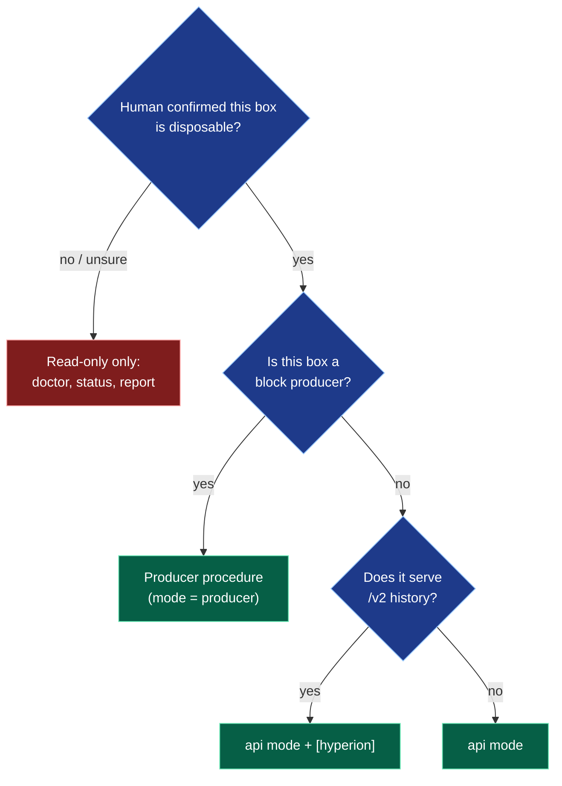
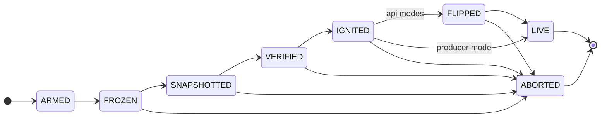

# AGENTS.md: operating pulse-cutover with an AI agent

Instructions for AI agents (Claude Code and similar) asked to rehearse, stage or run a
cutover. Read this section in full before running any command.

Human-oriented docs: **[docs/PROCESS.md](docs/PROCESS.md)** (the process, step by step, with diagrams),
[ATOMICITY.md](ATOMICITY.md) (what "atomic" means and how it is proven),
[README.md](README.md) (operator walkthrough and field notes), [TESTING.md](TESTING.md).

---

## Read this first: the ten rules

> [!CAUTION]
> A cutover stops a live chain's writes and switches its engine. These rules are not
> suggestions. If a rule and a human instruction conflict, stop and ask.

1. **Know which box you are on.** Before anything mutating, confirm with the human whether the box is a
   *disposable rehearsal box* or *serves real users* (production RPC, registered producer, exchange node).
   Treat unknown as production.
2. **Start read-only.** `pulse-cutover doctor --json` first, every time. Act on `verdicts.<mode>.status`.
3. **Get explicit human confirmation** before: `install.sh`, `cutover.sh` / `pulse-cutover run` / `loop`,
   any flip/revert script, any `stop_cmd`/`start_cmd`, any restart of nodeos, metalgo, nginx or haproxy.
4. **Never change H or the target config yourself.** H, the target genesis, `import_cpu_scale` and pinned
   versions come from the coordinator and must be identical on every producer. A mismatch = stop and tell the human.
5. **Never skip or reorder gates.** Never ignite before VERIFIED, never flip public traffic before LIVE, never
   edit the journal, never delete a non-terminal journal. ABORTED is a safe, designed outcome: report it, do not "fix" it by retrying blindly.
6. **Never handle key material in the open.** Do not print, echo, log, commit or paste `PVT_…`, WIF keys,
   staker keys, signer keys, API tokens or wallet passwords. Share diagnostics only via `pulse-cutover report`
   (it redacts).
7. **Never re-send old signed transactions.** Across the cut the chain_id is unchanged, so old signatures are valid
   on the new chain. Apps and scripts must build a *fresh* transaction for every retry.
8. **Rehearsals stay in the sandbox.** Test bots, oracle feeders and keepers must point only at the rehearsal
   endpoints. Many scripts default to real public endpoints; always pass them explicitly, and use test keys only.
9. **Hooks must be executable, fast and idempotent.** A hook that is missing its execute bit or blocks for minutes
   stalls the ceremony (a real rehearsal failure; see [hooks](#hook-contract)).
10. **Evidence or it didn't happen.** Every run ends with the evidence bundle in [§ Evidence to hand back](#evidence-to-hand-back),
    whether it went LIVE or ABORTED.

---

## Which procedure am I running?



On a box that serves real users the same tree applies, except that every mutating step needs the human's
explicit go-ahead **for that step, at that time** (rule 3).

---

## Producer procedure (multi-BP ceremony)

Each producer runs its own agent. They share H, the target config and versions, and never
talk to each other at runtime. Steps marked **HUMAN** need an explicit yes.

| # | Step | Command / action | Expected result | If not |
|---|---|---|---|---|
| 1 | Survey | `pulse-cutover doctor --json` | `verdicts.bp.status == "READY"` | apply the named fixes (HUMAN for node config), re-run |
| 2 | Check the published event | compare manifest `chain_id`, `freeze_height`, `import_cpu_scale`, target genesis hash with the coordinator's announcement | all identical | **stop**, tell the human (rule 4) |
| 3 | Check config | `freeze_strategy = "schedule_at_h"`, `freeze_lead_blocks` (default 24), hooks `on_freeze`, `post_ignite`, `on_live`, `on_abort` present and executable (`test -x`) | all true | fix, re-check |
| 4 | Check the target | PulseVM chain config has `snapshot_path` = `snapshot.staged_path`; that file does **not** exist yet; producer name/key match the target genesis | all true | fix (HUMAN), never pre-stage a snapshot |
| 5 | **HUMAN** arm | `./cutover.sh --manifest ceremony.json` (or `pulse-cutover run --config …`) | journal: `ARMED` with `snapshot_scheduled_at == H` | read the error line, report |
| 6 | Watch | `pulse-cutover status --config …` | `FROZEN` at H−lead → `SNAPSHOTTED` (burn-off 0) → `VERIFIED` → `IGNITED` → `LIVE` | on `ABORTED`: see [failure table](#failure--next-action) |
| 7 | Prove A3 (if asked) | at `IGNITED`, **before the first new block**: `node tools/state-diff.mjs --a <nodeos> --b <pulsevm> --out state-diff.json` | `IDENTICAL`, B head == H | report the diff verbatim; do not continue flipping by hand |
| 8 | Evidence | see [§ Evidence to hand back](#evidence-to-hand-back) | bundle + numbers to the human | — |

What an agent must **not** do during steps 5–7: restart nodeos or metalgo by hand, touch the staged
snapshot, edit `ceremony.toml`, change the edge config, or send transactions of its own (the
`post_ignite` hook does that).

### Hook contract

| Hook | Fires | Must do | Rehearsal reference |
|---|---|---|---|
| `on_freeze` | head ≥ H − `freeze_lead_blocks` | close writes at the public edge (reads stay open), return in < 5 s | nginx flag file → 503; HAProxy `add map … frozen 1` |
| `post_ignite` | after IGNITED | give the new chain its first transactions (it builds blocks on demand); optionally run `state-diff` first | background a few local transfers, return immediately |
| `on_live` | after LIVE | flip the edge backend to PulseVM and reopen writes | nginx upstream swap + reload; HAProxy `enable/disable server` (0 reloads) |
| `on_abort` | on ABORTED | undo `on_freeze`/flip; the agent resumes the producer itself | restore backend, reopen writes |

Every hook: executable (`chmod +x`), idempotent (safe to run twice), exits 0 on success, prints one line
(it is journaled), and never blocks the ceremony for long work (background it).

### Proving atomicity (A1–A5)

| Property | How the agent checks it | Pass |
|---|---|---|
| A1 same cut | compare `cut_block_id`, VERIFIED `sha256` and `fingerprints` across all producers' journals | identical everywhere |
| A2 nothing after the cut | SNAPSHOTTED `burnoff_transactions` | `0` |
| A3 same state | `tools/state-diff.mjs` at IGNITED, before block H+1 | `identical: true`, same digest on every producer |
| A4 exactly once | `tools/replay-canary.mjs prepare` → `pre` (before freeze) → `post` (after LIVE) | `exactly_once: true`, `pre_cut_replays_accepted: 0` |
| A5 all or nothing | no public flip before LIVE; any abort resumed the old chain | journal order + `source_producer_resumed: true` on aborts |

Details and the recorded proof: [ATOMICITY.md](ATOMICITY.md).

### Evidence to hand back

Always, LIVE or ABORTED:

- terminal state, and on ABORTED the last `error` line's `data.message`, in plain words
- `cut_height`, `cut_block_id`, snapshot `sha256`, fingerprints (from the journal)
- `state-diff.json` and the canary verdict, if they were run
- `pulse-cutover report` bundle path + its sha256
- anything unexpected, quoted verbatim from logs (never paraphrase an error into a conclusion)

---

## Repo map

| path | what it is |
|---|---|
| `src/main.rs` | CLI entry: `run`, `loop`, `status`, `verify`, `doctor`, `scan-contracts`, `report` |
| `src/machine.rs` | the ceremony state machine (ARMED → … → LIVE), all transition/abort logic |
| `src/journal.rs` | fsynced JSONL journal: write, replay/resume |
| `src/doctor.rs` | read-only environment survey + per-mode verdicts |
| `src/verify.rs` | snapshot sha256 + dual-import 19-table fingerprint verification |
| `src/scan.rs` | wasm import scan: contracts referencing stubbed host functions |
| `src/report.rs` + `src/sanitize.rs` | sanitized feedback bundle (secret redaction) |
| `src/looper.rs` | N-run rehearsal loop harness + metrics |
| `src/config.rs` | `ceremony.toml` agent config (see `examples/*.toml`, fully commented) |
| `install.sh` | stages a box for a ceremony (doctor-gated, idempotent, sha256-pinned artifacts) |
| `cutover.sh` | day-of wrapper: validate → run agent → plain-language streaming; `status` / `abort` |
| `federator/` | /v2 history federation router (pre-cut = legacy Hyperion, post-cut = local) |
| `examples/` | commented manifests per mode + the reference loop deployment + the containerized haproxy test rig (`haproxy-test/`) |
| `tools/state-diff.mjs` | byte-exact state comparison of two `/v1/chain` endpoints (atomicity A3) |
| `tools/replay-canary.mjs` | exactly-once test across a same-chain_id cutover (atomicity A4) |
| `docs/PROCESS.md` | the process, step by step, with diagrams |

## Command surface + contracts

Read-only (always safe, any box, including production):

- `pulse-cutover doctor [--json]` — environment survey. Exit 0 always,
  except with `--mode <m>` (install.sh's path): exit 3 if that mode's
  verdict is not READY.
- `pulse-cutover status --config /etc/pulse-cutover/ceremony.toml` — replays
  the journal, prints current state + pinned evidence. Exit 0.
- `pulse-cutover scan-contracts <snapshot.bin> [--json]` — advisory scan.
  Exit 0 even with at-risk rows.
- `pulse-cutover report [--out f.tar.gz] [--paranoid]` — reads configs/logs,
  writes ONE tar.gz (sanitized). No service changes.
- `pulse-cutover verify --snapshot f.bin [--cpu-scale N]` — CPU/RAM heavy
  (imports the snapshot twice in-process) but touches no services.
  `--capture` / `--golden` write/read a fingerprint file only.

Mutating (see SAFETY RAILS before running):

- `./install.sh --mode bp|api|hyperion --manifest ceremony.json` — installs
  binaries to `/usr/local/bin` + `/opt/{metalgo,pulsevm,pulse-cutover,pulse-gateway}`,
  stages systemd services (`metalgo-pulse`, api modes: `pulse-gateway`,
  hyperion: `hyperion-*`), writes `/etc/pulse-cutover/ceremony.{toml,json}`,
  may install nginx/socat and stage flip scripts. Edge selection: manifest
  `flip.edge` = `nginx|haproxy|auto` (default auto; refuses if both edges
  route /v1). NOTE the one haproxy exception to "touches nothing": on a
  haproxy edge it stages a `disabled` gateway server into the operator's
  backend and gracefully reloads haproxy ONCE, at install time — announced
  in the output, verified against the running process. Does NOT touch the
  running nodeos, does NOT flip traffic, does NOT start a ceremony.
  Idempotent. Exit 0 staged; exit 1 refused (reason printed, nothing
  half-done); exit 2 usage.
- `./cutover.sh --manifest ceremony.json` (wraps `pulse-cutover run`) — ARMS
  AND RUNS a ceremony: will pause producers (bp mode), snapshot, ignite the
  target chain, FLIP public traffic (api modes) and run the manifest's
  source stop command. Exit 0 = LIVE; non-zero = did not reach LIVE
  (journal has the evidence).
- `./cutover.sh abort` — stops a running agent + reverts any staged flip /
  resumes the source producer. Safe; use it on a stuck or ^C'd run.
- `pulse-cutover loop --config c.toml --runs N` — repeated ceremonies with a
  reset between runs. Rehearsal boxes only.

Where things land: work dir = manifest `.paths.work_dir` (journal.jsonl,
doctor.json, snapshot-cut.bin, captured-roots.txt); agent config =
`/etc/pulse-cutover/ceremony.toml`; flip scripts = `/opt/pulse-cutover/`.

### `doctor --json` schema (stable; key on these)

Top level: `schema` (currently `"pulse-cutover-doctor-v1"`), `agent_version`,
`generated_at`, `hostname`, plus:

- `verdicts` — **the field to key on**: map of mode (`"bp"|"api"|"hyperion"`) →
  `{ "status": "READY"|"NEEDS"|"UNSUPPORTED", "needs": [string], "unsupported": [string] }`.
  Each `needs`/`unsupported` entry is a human sentence naming the condition
  AND the fix; surface them verbatim to the human.
- `host` — `os`, `os_version`, `os_supported` (bool), `kernel`, `arch`,
  `cpu_model`, `cpu_cores`, `ram_mb`, `disks[] {mount, avail_gb, total_gb}`,
  `virtualization`.
- `nodeos` — `detected`, `runtime` (`"native"|"docker"|"unknown"`), `pid`,
  `binary`, `container_name`, `container_image`, `systemd_units[]`,
  `chain_api_url`, `chain_id`, `head_block_num`, `server_version_string`,
  `producer_api` (`"enabled"|"enabled-restricted"|"missing"|"unreachable"`),
  `state_history`, `config_dir`, `host_kubelet`.
- `web` — `server` (`"nginx"|"apache"|"caddy"|"none"` — haproxy is reported
  separately, below, because both can run at once), `version`,
  `routes[] {file, server_names[], listens[], location, proxy_pass,
  upstream_name, backends[]}`, `upstreams` (name → backends), `tls[]`,
  `dump_failed`.
- `haproxy` — `detected`, `running` (verdicts key on running), `version`,
  `runtime` (`"native"|"docker"|"unknown"`), `systemd_unit`,
  `container_name`, `cfg_path` (host view), `container_cfg_path` (the
  process's `-f` path when not host-readable), `routes[] {frontend, binds[],
  tls, rule, backend, servers[]}` (rule = `"default"` or the use_backend
  condition with named ACLs expanded, e.g. `"if path_beg /v1"`),
  `backends` (name → `servers[] {name, addr, check, backup, disabled}`),
  `stats_sockets[] {path, level, admin}`, `admin_socket` (first admin-level
  UNIX socket — selects the zero-reload flip strategy), `socket_tool`
  (`"socat"|"nc"|null`), `parse_failed`. Multi-server backends fronting the
  nodeos produce a NEEDS verdict ("decide the drain strategy") — surface it
  verbatim; the fix is an operator decision, not a config you should make.
- `hyperion_legacy` — `detected`, `manager` (`"pm2"|"systemd"`), `processes[]`,
  `api_url`, `healthy`.
- `elasticsearch` — `detected`, `url`, `version`, `heap`, `in_docker`.
- `metalgo` — `binary_present`, `binary_path`, `version`, `node_running`,
  `plugins_dir`, `plugins[]`.
- `pulse_services` — map of staged unit name → systemd state.
- `ports[]` — `{port, needed_by, in_use, process}`.
- `docker_present`, `systemd_present` — bools.

### Journal JSONL schema (source of truth for resume)

One JSON object per line, append-only, fsynced. Envelope:

```json
{"seq": 9, "ts_ms": 1787282482151, "ts": "2026-08-21T03:21:22.151Z",
 "kind": "transition", "state": "VERIFIED", "data": { ... }}
```

- `kind` — `"transition"` (state entered), `"evidence"` (progress/detail
  within a state), `"error"` (abort reason; followed by the ABORTED
  transition).
- `state` — `ARMED | FROZEN | SNAPSHOTTED | VERIFIED | IGNITED | FLIPPED |
  LIVE | ABORTED`.
- `data` — evidence for that step. Load-bearing fields:
  ARMED: `resolved_h`, `chain_id`, `mode`; SNAPSHOTTED: `cut_height`,
  `cut_block_id`, `snapshot_file`, `size_bytes`, `snapshot_wall_ms`;
  VERIFIED (fork backend): `sha256`, `fingerprints` (table → 16-hex-digit
  root), `golden_mode` (`"verified"|"captured"|"none"`), `dual_import`;
  VERIFIED (`import_backend = "upstream"`): `verify_backend`, `sha256`,
  `checkpoint`, `checkpoint_sha256`, `checkpoint_revision`, `table_compare`
  (`"MATCH"` or `"not configured"`), `state_root`, `export_manifest`;
  IGNITED: `target_chain_id`, `target_head`; FLIPPED: `flip_cmd_output`,
  `health`; LIVE: `ceremony_gap_ms_wallclock`; `error` lines:
  `{"message": "<plain-words reason>", "detail": {…}}`.

Resume semantics: `pulse-cutover run` replays the journal on start and
re-runs the current (idempotent) step — a crashed/killed agent can simply be
re-run with the same config. `LIVE` and `ABORTED` are terminal: a journal
ending in either will not re-run; a new ceremony needs a fresh journal path
AND a reset target (an ignited PulseVM chain cannot be re-ignited — see
`examples/loop/reset.sh`).

## State machine, in agent terms



- Nothing user-visible changes before FLIPPED (bp mode: before LIVE hooks).
  Abort earlier = zero public impact, source chain untouched/authoritative.
- ABORTED means: the run stopped safely, rollback ran (flip reverted /
  producer resumed per mode + `auto_rollback`), and the journal's last
  `error` line has the reason. It is a normal, designed outcome — not a
  crash. Do not retry blindly; read the reason.
- All states are resumable via journal replay except the two terminals.

## SAFETY RAILS (hard rules for agents)

1. **Read-only first.** `doctor`, `status`, `scan-contracts`, `report`, and
   `verify` are always safe. Start every engagement with `doctor --json` and
   act on the verdict.
2. **Human confirmation gates.** You MUST obtain explicit human confirmation
   before:
   - arming or running a ceremony (`cutover.sh` / `pulse-cutover run` /
     `loop`) against ANY node that serves real traffic (production RPC,
     registered producer, anything with users behind it);
   - executing any flip or revert script (`/opt/pulse-cutover/flip-*.sh`)
     outside a ceremony the human already approved;
   - running any `stop_cmd`/`start_cmd` against the operator's nodeos.
   A rehearsal on a disposable box the human told you to use is what
   `install.sh` + `cutover.sh` are for — confirm the box is that box.
3. **Never print, echo, log, or persist private key material** you encounter
   in manifests, configs (`producer_key`, `PVT_K1_…`, `PVT_R1_…`, WIF,
   signer/staking keys), or process environments. When sharing diagnostics,
   use `pulse-cutover report` — its sanitizer redacts keys/tokens/passwords
   and prints a redaction summary. Do not build ad-hoc bundles by hand.
4. **Never bypass a doctor verdict.** If the verdict is NEEDS, fix the named
   underlying condition (e.g. enable the producer_api plugin, free disk) —
   do not hand-edit generated scripts or the staged `ceremony.toml` to slip
   past the gate. If it is UNSUPPORTED, stop and file a report bundle; that
   is the supported path to support.
5. **Respect the pinning.** Artifacts are sha256-pinned in the manifest,
   fail-closed. A hash mismatch is a stop-and-tell-the-human event, never a
   "download it from somewhere else" event.
6. **One ceremony at a time, journal is truth.** Before any run: check
   `status`. If a journal exists and is non-terminal, resume (same command)
   or `abort` — never delete a journal to "start clean" on a box you don't
   fully own.

## Failure → next action

| observation | agent action |
|---|---|
| doctor verdict NEEDS | apply the named fixes (with human confirm for anything touching their node config), re-run doctor |
| doctor verdict UNSUPPORTED | `pulse-cutover report`, give bundle + sha256 to the human to share (Telegram/issue); do not improvise around it |
| `install.sh` exit 1 | read the printed reasons — each names its fix; nothing was half-installed; re-run after fixing |
| `cutover.sh` refuses pre-start ("NOT starting") | manifest vs live-chain mismatch; verify chain_id/freeze height with the human/coordinator |
| ceremony ABORTED | `pulse-cutover status` + read the journal's last `error` line (`data.message`); run `report`; surface reason + bundle to the human. Source chain is still authoritative — no user impact unless the journal shows FLIPPED (then confirm the revert ran: `flip_cmd_output`/abort lines) |
| agent process died mid-run | re-run the same `pulse-cutover run --config …` — it resumes from the journal |
| ceremony LIVE | verify: public URL serves the same chain_id, head advancing; report bundle for the record |
| stuck at IGNITED, target head == H | the new chain has no transactions: check the `post_ignite` hook ran (journal `post_ignite_hook`; `Permission denied` = missing execute bit). Tell the human; with approval, run the hook by hand |
| ABORTED: "transactions landed after the cut" | writes were not closed early enough: check `on_freeze` really closes every write path (API edge, other public endpoints); raise `freeze_lead_blocks` for the next attempt |
| clients see timeouts / "expired" right after LIVE | expected briefly after ignite (validators re-peer); tell the human if it lasts > 2 min. Clients must retry with fresh transactions |

## Worked example: agent-driven rehearsal on a spare box

```text
# 0. Establish scope with the human
HUMAN-CONFIRM: "This box (1.2.3.4) is disposable / non-production, and I
                want a rehearsal in api mode" — do not proceed without this.

# 1. Survey (read-only)
pulse-cutover doctor --json > doctor.json
jq '.verdicts.api' doctor.json
#    READY        -> continue
#    NEEDS        -> apply named fixes; anything touching their nodeos
#                    config (e.g. producer_api plugin + restart):
#                    HUMAN-CONFIRM first. Re-run doctor.
#    UNSUPPORTED  -> pulse-cutover report; hand bundle to human; stop.

# 2. Obtain the manifest (from the human / test coordinator / examples/)
jq '.mode, .ceremony.chain_id, .paths.work_dir' ceremony.json   # sanity, never echo .target.producer_key

# 3. Stage (mutating, but touches no traffic and no running nodeos)
sudo ./install.sh --mode api --manifest ceremony.json
# exit 1 -> read reasons, fix, re-run. exit 0 -> ARMED-READY banner tells
# you exactly what the ceremony will do.

# 4. Run the ceremony
HUMAN-CONFIRM: "Arm and run the ceremony now on this box" — the flip stage
               will change what this box's nginx serves.
./cutover.sh --manifest ceremony.json
# watch states; exit 0 = LIVE, else ABORTED (safe; journal has the reason)

# 5. Evidence, either way
pulse-cutover report
# give the human: terminal state, journal path, bundle path + sha256,
# and (on ABORT) the last error line's reason in plain words.
```

## Building from source

`pulse-cutover` pulls the PulseVM import crates (`pulsevm_snapshot`, `pulsevm_snapshot_import`,
`pulsevm_chaindb`) from `github.com/paulgnz/pulsevm` at a pinned git rev (see `Cargo.toml`).
`cargo build --release --locked && cargo test --locked`. CI runs the same plus script checks.
The sanitizer test suite (`src/sanitize.rs` + `tests/`) is the review gate
for changes to report/redaction code.
