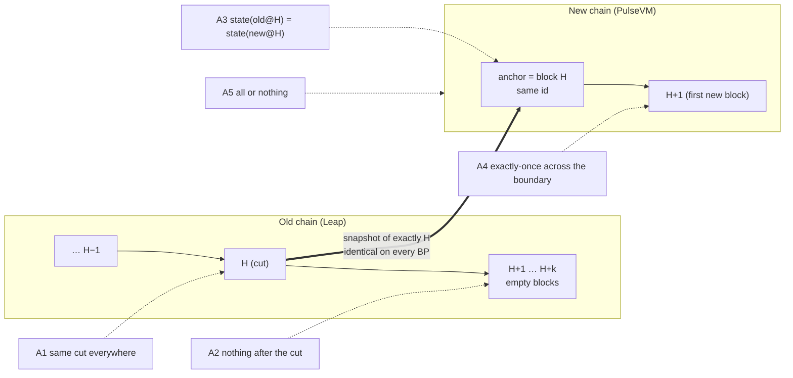

# Atomicity: what we claim, and how each claim is proven

A cutover keeps the **same chain_id**, so a transaction signed for the old chain is also
validly signed for the new one. That keeps the signing domain for wallets, exchanges and
bots unchanged (validity still depends on TAPOS, expiry, permissions and deduplication), and
it is also why the cut has to be **atomic**: every transaction should land on exactly one
side of the boundary, exactly once, with the same state on both sides. That is the
requirement; this document records how far the evidence goes towards it.

This document breaks "atomic" into five properties, names the evidence for each, and
records the rehearsal that produced that evidence. Some checks are ceremony gates (the
ceremony aborts if they fail); others are optional tools in [`tools/`](tools/) whose output
is kept as evidence. Producing evidence automatically is not the same as a mandatory
fleet-wide barrier, and run 5 needed a manual step.

> [!IMPORTANT]
> **Status at a glance (2026-09-29)**
> - **Proven in rehearsal** (5 BPs, private Metal network, fork plugin): the same cut block, snapshot hash and table
>   fingerprints on every BP (A1); zero transactions after H in every successful run (A2); a symmetric abort where all
>   5 BPs resumed the old chain (run 1).
> - **Demonstrated on a sample only**: state equality on 19 accounts / 5 contracts / 32 table scopes (A3); a replay
>   canary of 10 held + 10 pre-cut transfers (A4).
> - **Not done**: A5 (fleet-wide all-or-nothing) is not implemented; nothing has run on Tahoe; validators shared one
>   producer key. See [Known limits](#known-limits-independent-review-2026-09-29)
>   and [Upstream stack re-qualification](#upstream-stack-re-qualification).
> - **Update 2026-10-06** (5 BPs on upstream PulseVM v1.0.0, metalgo 1.14.2, private Metal network, rc.22): identical
>   state at H on all 5 and against a reference nodeos in every run, but **every healthy run ended with LIVE and
>   HALTED BPs on one target chain**, and in one run (r4) **a BP resumed the old chain after its peers ignited** and
>   took 33 writes after H. rc.23's response and what it does not solve: Known limits #1 and #14.



| # | Property | Why it matters | Evidence | Kind |
|---|---|---|---|---|
| **A1** | **Same cut on every producer**: every BP snapshots the same block H, byte-for-byte | Validators that import different states fork on the first block | `schedule_at_h` pins the snapshot to H's block id; each BP's journal records the file name `snapshot-<id of H>.bin`, its sha256 and 19–21 table fingerprints. Scheduled producer runs produced identical H artifacts; the fallback snapshot path, restart recovery and API mode do not yet enforce exact H, and agreement is not checked against a complete roster | gate (producer mode) + cross-BP comparison |
| **A2** | **Nothing lands after the cut**: zero transactions in H+1 … pause | Anything after H is on the old chain but not the new one, so it silently disappears | Writes close `freeze_lead_blocks` before H; the **burn-off audit** reads every block from H+1 to the pause and aborts on any transaction (fail-closed: an unreadable block also aborts) | gate |
| **A3** | **Same state on both sides**: accounts, permissions, keys, contracts (code and ABI hash) and table rows on the new chain at H equal the old chain at H, *for the state the diff surveys* (seeded accounts, every contract found, every scope of every ABI table). Not yet a whole-state commitment: see Known limits | Shows equality of the successfully enumerated, normalized sample; comparator errors and pagination caps are not yet fail-closed | `tools/state-diff.mjs`: byte-exact diff of the paused old chain against the new chain **before its first new block**, run on every BP by the `post_ignite` hook. Plus dual import with identical fingerprints (VERIFIED gate) | tool on every BP |
| **A4** | **Exactly once across the boundary**: a transaction executed before the cut does not execute again after it; one signed before but sent after executes once | Same chain_id makes pre-cut signatures valid on the new chain, so a replay would be a double spend | `tools/replay-canary.mjs`: pre-signs transfers with a long expiry, sends half to the old chain before the freeze, then after LIVE sends **all of them twice** to the new chain. Checks the receiver's balance delta equals the held half exactly. Plus app-level reconciliation (HFT and perps bots: 0 duplicate orders). A passing sample, not a general exactly-once result: some orders admitted after LIVE never executed (see note below), and the verdict rests on an aggregate balance delta | tool |
| **A5** | **All or nothing**: either every producer moves to the new chain or the old chain carries on untouched | Half a network on each chain is a fork | **Not implemented as a fleet property.** Each producer aborts and resumes locally on a gate failure; run 1 showed a *symmetric* abort (all 5 resumed). There is no fleet-wide authority boundary, so a partial abort after some producers ignite is not prevented. The write freeze is user-visible, and in API mode the public flip can precede LIVE | local gate only; open |

## Evidence from the 5-BP rehearsal

Rehearsal setup: 5 BPs on 5 continents, each running a Leap 5.0.3 producer, a Metal
validator and a public TLS API edge (nginx on three, HAProxy on two). Apps write through
the edges the whole time: a 0.5 s transfer bot, a perps DEX order bot, an oracle feeder
and a keeper. Full timelines are in the [README](README.md#multi-producer-cutover-5-bps-5-continents).

### Run 5: A1–A4 exercised in one ceremony (2026-09-28, cut at H = 6220)

| # | Result | Evidence (per BP, all 5 identical) |
|---|---|---|
| **A1** same cut | ✅ **5/5 identical** | cut block `0000184cbaf7c1cd…` at 6220 · snapshot sha256 `5e315ecb4943b693…` · 19-table fingerprints identical · PulseVM anchored on the same block id `0000184cbaf7c1cd…` |
| **A2** nothing after the cut | ✅ **0 transactions** | burn-off audit: 62 blocks from H+1 to the pause, 0 transactions, on every BP, with four bots still hammering the API edges (writes closed at H−24) |
| **A3** same state | ✅ **identical on the surveyed state, 5/5** | `state-diff`: old chain (paused at 6282) vs PulseVM at **exactly 6220**, before its first new block. 19 accounts (permissions, keys, privileged flag), 5 contracts (code hash + ABI hash), 32 table scopes (every row as raw bytes). State digest `c21764756abb1080…` on both sides, on every BP |
| **A4** exactly once | ✅ **0 replays, 0 losses, 0 duplicates** | `replay-canary`: 10 transfers executed on the old chain before the cut were re-sent twice to PulseVM → **all 20 attempts rejected** (`duplicate tx`: the imported state carries the recent-transaction dedupe set). 10 transfers signed before the cut but held → **executed exactly once**, second sends rejected; receiver delta = exactly 10 transfers. Perps order bot: 483 cycles, **0 duplicate orders**, every order admitted before the cut is on the book |
| **A5** all or nothing | ⚠️ **not proven** | every BP reached LIVE, so no asymmetric case occurred. Run 1 showed a symmetric abort (all 5 resumed); a partial abort is not prevented by the tooling (Known limits #1) |

Timeline (bp1, UTC): ARMED 23:54:34 · FROZEN 23:56:47 · SNAPSHOTTED 23:57:32.6 · VERIFIED 23:57:32.6 ·
IGNITED 23:57:45 · LIVE 00:05:59.5. All five BPs hit each transition within 1.5 s of each other.

> [!NOTE]
> The long gap between IGNITED and LIVE in run 5 has two causes: a packaging error (the `post_ignite`
> hook shipped without its execute bit, so no heartbeat reached the new chain) and a ceremony gap (a
> required hook failing did not stop the run). Every BP held the new chain at exactly H for 8 minutes,
> which is when the A3 state diff was taken; the heartbeat was then sent by hand. Writes stayed frozen
> (HTTP 503) the whole time: 1,103 refused writes on the HFT bot, none lost. Measured write gaps
> (journal `write_gap_ms_wallclock`): run 2 ≈ 243 s (manual traffic), runs 3 and 4 ≈ 72 s and 71 s,
> run 5 ≈ 553 s, run 6 101–114 s.

> [!NOTE]
> "Admitted" on PulseVM means accepted into the mempool, not executed. One perps order per run (runs 4 and 5)
> was admitted **after** LIVE and never executed. That is a post-cut mempool/execution
> behaviour, not a boundary loss: nothing admitted by the old chain was lost, and nothing
> crossed the boundary twice.

The full per-BP evidence (journals, snapshot hashes, `state-diff` reports, canary transcript,
bot ledgers) is archived with the rehearsal notes; a per-run summary with what each run does and does not prove is in
[docs/EVIDENCE.md](docs/EVIDENCE.md).

### Earlier runs of the same rehearsal

| Run | Properties exercised | Outcome |
|---|---|---|
| 1 | A1, A2, **A5** | identical snapshot on all 5; 3 transactions leaked into H+1 → **every BP aborted and resumed the old chain** (the gate working as designed); led to `freeze_lead_blocks` |
| 2 | A1, A2 | LIVE on all 5 (LIVE waited on manual post-ignite traffic; gap ≈ 243 s); identical fingerprints and anchor id; balances continuous |
| 3 | A1, A2, apps | LIVE unattended through public edges (gap ≈ 72 s); surfaced a mempool bug in the plugin build that dropped admitted transactions (fixed upstream, fork rebuilt) |
| 4 | A1, A2, apps | LIVE with a perps DEX, oracle and keeper (gap ≈ 71 s); 0 duplicate orders; 79/79 transfers landed; ~50 s post-LIVE stall (unexplained) |
| 6 | **A1–A4, unattended, one public URL** | gap 101–114 s, local LIVE spread ~13 s; all 7 evidence values agreed 5/5 on mission control; `state-diff` ran automatically at H = 8539 on every BP: identical on the sample, digest `df0f4017e7ba97bc…`; replay canary passed (0 pre-cut replays accepted, 10/10 held landed once). A5 not exercised |

## Known limits (independent review, 2026-09-29)

An independent read-only review of this repository, the installer and the rehearsal evidence found that the
rehearsal proves the failure classes above are real and catchable, but **not yet** that a 37-producer mainnet cut
is safe. Open items, most severe first:

| # | Limit | Why it matters |
|---|---|---|
| 1 | **No fleet-wide authority boundary, and none can be built by this tool alone.** *Seen in a fleet run (2026-10-06, r4): one BP lost the relay before chain creation (quorum 4 of 5), its four peers created and ignited the target, and at its fleet timeout it aborted, resumed the old chain and reopened writes: 33 user writes landed after H, and the paused peers' nodeos followed that fork. rc.23 makes that agent STRANDED instead (see #14), but the boundary is still local.* Since rc.6 a producer never resumes the old chain after its *own* ignition started (it HALTS); since rc.21 the same holds from the moment its chain-creation hook starts, aborts are final tombstones, and creation/ignition need a positive "no abort" from the relay. All of that is **local**: a producer that aborts before its own boundary cannot know whether another has created or ignited a target, the fleet gate compares unsigned relay reports, and `/v1/producer/pause` is not a durable, restart-surviving source fence. | A partial abort can still split the network. A fleet-wide point of no return needs an **upstream sealed start** (the target cannot produce until a durable, fleet-signed commit exists), durable source fencing, and BP-signed preparation with a governed threshold (docs/DESIGN-authority-boundary.md, still a design). Nothing in rc.21 should be read as closing this. |
| 2 | **Exact H is implemented but not rehearsed.** Since rc.5/rc.6 every mode schedules the snapshot at H, refuses any other height, restores that on restart and checks the target's block id at H; none of this has run on real boxes or upstream v1.0.0 yet. | Until rehearsed, treat it as untested code. |
| 3 | **Coordination is single-key with unsigned fleet evidence.** One coordinator signature arms; the relay is now durable (fails with 503 rather than accept what it can't persist) and events can bind a roster and quorum, but producer reports are not signed and validator weight is not modelled. | Needs a signed immutable manifest, threshold authorization, a durable event log, and a complete roster before arming. |
| 4 | **Shared producer identity.** The fork plugin requires every validator to run the same producer name and key. | Unacceptable for mainnet custody; needs per-validator authoring identity. |
| 5 | **State evidence is narrower than "every account"**: `state-diff` covers the accounts and tables it discovers; fingerprints are 64-bit; both imports use the same importer. | Needs a complete, cryptographic whole-state commitment checked by an independent implementation. |
| 6 | **Crash recovery is implemented, not certified.** Exclusive journal lock, torn-tail repair, staged-artifact and ignition-start records, durable HALTED and process-group hook timeouts exist (rc.6) and have unit tests. A Linux fault-injection run with stubbed nodeos/metalgo passed on rc.10 after finding and fixing a critical process-group kill bug ([docs/EVIDENCE.md](docs/EVIDENCE.md#linux-fault-injection-rc9-and-rc10)); not yet exercised with real chain services or a fleet. | A crash mid-ceremony must never produce a later-H snapshot or an accidental resume. |
| 7 | **Validator registration and METAL funding** are not automated or certified. | Every producer needs an accepted, funded validator before H can be scheduled. |
| 8 | **The ~50 s post-LIVE stall** is unexplained. | Clients see timeouts right after the cut. |
| 9 | **Parts of the Leap 5 `/v1` surface are not served yet.** The /v2 state gap (an account untouched since the cut got an empty token list from the post-cut index) is closed: the federator now reads balances and permissions from the chain and uses the indexes only for discovery, and the /v1 edge polyfills most of the rest. Still 501 until upstream adds them: `get_code`, `compute_transaction`, `send_read_only_transaction`, `get_scheduled_transactions` (PulseVM keeps deferred transactions but cannot list them), and `get_transaction_id` for JSON action data. Partial: `get_producer_schedule` (active names only), `get_block_header_state`, `get_raw_code_and_abi` (no wasm); static at the cut: protocol features, consensus parameters. [docs/V1-COVERAGE.md](docs/V1-COVERAGE.md) | Dapps calling those endpoints get a clear 501 instead of a wrong answer; discovery-based answers are only as complete as the indexes. |
| 10 | **Action sequence continuity depends on the export sidecar.** SHiP carries no sequence counters; `global_action_sequence` and every account's recv/auth/code/abi sequence come only from `deferred-transactions.json`. Since rc.15 the upstream backend refuses a sidecar without `source_chain_id`, from another block, with no account rows or a zero global sequence, and refuses one whose recv sequences do not sum exactly to the global sequence (checked exact on a real XPR testnet export: 1,983,236,481 both). PulseVM does not require the sidecar itself (upstream issue #101), and its onblock traces are absent from SHiP, so SHiP consumers see one `global_sequence` value missing per block. | Clients that page history by sequence (exchange deposit polling, gap-checking indexers) would see a reset or gaps if a checkpoint were built without a complete sidecar. |

| 11 | **Upstream ignition on PulseVM v1.0.0 is rehearsal-grade only.** The agent can boot the target from the #61 checkpoint (full-block anchor, migration genesis, chain config, chain created by `create_chain_cmd`), but on v1.0.0 that needs two rehearsal-only overrides: the 19-table compare fails on `contract_index_double` and `global_property` (upstream regression in `history.rs`), and the target signs with metalgo's blockchain id instead of the source chain_id. TAPOS is not enforced. The overrides are refused for XPR mainnet, and an upstream ignite is refused for mainnet while those gaps remain (`upstream::ignite_pending_reasons`). Unit- and integration-tested with stand-in tools; no full ceremony on real services has run yet. | A same-chain-id cutover cannot be done on v1.0.0: old signatures would not verify on the target (different chain_id), and without TAPOS a transaction signed on a leftover source chain could replay once the chain_id is pinned. Two of 21 tables are not independently verified on v1.0.0. |

| 12 | **Acknowledged is not executed.** In the stage-2 runs that reached LIVE, 136, 77 and 4 transactions the edge acknowledged were never included (upstream issue: transactions consumed by a block build that is later refused are not restored). rc.21 stops the edge from claiming more than it knows (no invented failure-trace blocks, `retry_trx` refused, batches stop on disconnect) and the post-LIVE watch fails on regression and identity changes, but **LIVE still means "the target produces", not "user transactions are included"**: the configured `post_live_probe_cmd` is the only workload evidence, and one cheap probe from a healthy payer can mask a failing workload. | Apps must reconcile every transaction id (AGENTS rule 7, docs/EXCHANGES.md); a public cut needs upstream terminal transaction outcomes. |
| 13 | **History boundary and identity are now enforced, not certified at scale.** The federator refuses legacy rows above H, validates its boundary file against the chain and the legacy archive and fails closed (rc.21); legacy archives that report no chain_id are only checked at the cut block. Not yet run against a production-sized legacy archive or with real exchange pollers. | Deposit pollers must use the status header (absent / not_indexed_yet / unavailable) and treat H as the end of the old chain (docs/EXCHANGES.md). |
| 14 | **Fleet outcome after ignition is per node; rc.23 makes it fleet-aware, not fleet-decided.** On upstream v1.0.0 with 5 WAN validators the target is slow and gappy (~1.35 s per accepted block, 11–39 s gaps, multi-minute crawls), and each BP judged its sustained-LIVE window and hooks on its own observations: r2 ended 2 LIVE / 3 HALTED, r3 and r6 4 / 1, r5 2 / 3, all on one chain. rc.23: (a) a coordinated producer that froze writes resumes the old chain only when its resume guard passes twice around a withdrawal of its own VERIFIED report: nobody missing, conflicted or ever reported past chain creation, and fewer than `quorum` other members still in the ceremony (the quorum is unreachable without it), or a signed abort with every member accounted for; otherwise it is **STRANDED** (sealed, source paused, writes frozen). That is a check of unsigned reports at one moment, not proof that no peer ignites; (b) `pulse-cutover join` lets a STRANDED/ABORTED BP track the chain a LIVE quorum runs, after checking its own artifacts against theirs and that its source took nothing after H; (c) after ignition a local symptom is waited out as **degraded** (bounded) while a quorum reports the same target chain; (d) mission control shows a fleet verdict per event and a red SPLIT alarm (a member resumed the old chain after peers ignited; members on different chains). rc.25 (fleet runs c1–c5 on rc.24): the guard also requires this node's own report to be visible on the relay; `join --reverify` gives a BP whose own verification failed a route onto the LIVE chain (re-verify, then equal evidence); in the 4-of-5 scenario that cascaded (c3a) degraded mode now waits for a lagging peer instead of halting (shown by tests, not yet by a fleet re-run); one timed-out target read no longer flaps the verdict. | All of it reads **unsigned relay reports**: an agent that cannot reach the relay strands (safe) but cannot learn the fleet's decision, and a compromised relay could mislead it. It still cannot stop a BP running an older version, a BP whose operator resumes by hand, or the old chain continuing on its own. What closes this is upstream: a **sealed start** (the target cannot produce until a durable, fleet-signed commit exists), a fleet COMMIT/ABORT certificate the agents verify instead of relay reports, and a guard that stops the old chain after H. |
| 15 | **Aborts the resume guard does not cover.** (a) An abort in ARMED, before this node's write freeze (e.g. a failing `on_freeze`, a signed abort, a refused production profile): the node never paused, so it keeps producing through H while its peers freeze and cut; its blocks after H reach the peers' quiescence window (they abort on late blocks) or, if its slots fall after their pause, continue the old chain. (b) API (and hyperion) mode: an API node that aborts before its own ignition while peers ignited reverts nothing it had not changed, so its public URL keeps serving the old chain (an api-mode guard is not implemented; its `needs_resume_guard` is producer-only). (c) A relay that never answered and a node that never ran its beacon can only strand. | (a) and (b) leave readers or a producer on the old chain next to a new one. Operators watch the fleet verdict (SPLIT alarm) and fence by hand; the upstream sealed start and an old-chain guard after H close it. |
| 16 | **Mission control is not yet a durable evidence store (rc.27).** The resume guard blocks on any roster member's past-creation evidence, from any of its instances and from the relay's per-event record, including reports for another H. That record can still be lost in ways an independent review reproduced: an older event's ordinary past-creation record can be trimmed after more than 20 newer signed events; a report accepted before its event is relayed, or while mission control lost its coordinator store, leaves no record, so a later ABORTED report makes the member look clean; foreign observations do not carry the target chain's identity, and a clear by H alone retires every observation at that H; unresolved records have no hard size bound. In each case an agent can be authorized to resume the old chain while a target it no longer sees may run. | The relay's evidence is advisory, as every relay fact is (#1, #14). rc.28 moves it to an append-only creation-evidence log (every accepted past-creation report, published event or not; observation ids with target identity; per-producer cap with a blocking overflow; retirement only by observation id). The real fix remains upstream: a fleet-signed commit point (#1). Until then: one event at a time, never clear relay evidence without fencing the target first, and treat a STRANDED producer's `rollback` as a fleet decision. |

These are tracked as the priority list for the next release. The rehearsal results above stand as evidence for what
they measured, and nothing more.

## Upstream stack re-qualification

Every run above used the fork plugin (`v0.0.0-arena-mempoolfix.1` lineage) on metalgo 1.13.5 (plugin protocol 43) on a
private Metal network, with one shared producer key. Before any result is relied on for a public cut, re-run it on the
intended stack (upstream PulseVM v1.0.0, protocol 45, metalgo 1.14.x on Tahoe):

- exact-H import, source block-id preservation, target lineage at H and full state coverage;
- TAPOS, unexpired-transaction deduplication, expiry and replay behaviour;
- distinct validator identities, authoring permissions and independent key custody;
- loaded application reconciliation (per-transaction inclusion), dependent transactions and restart behaviour;
- the post-LIVE stall, with consensus, peer, VM and inclusion traces;
- every supported edge adapter and the legacy Hyperion / AtomicAssets fixture;
- validator registration and funding on the actual deployment model (classic subnet or converted L1);
- asymmetric failures: stale or missing participant, relay restart, source restart, early target start, partial LIVE,
  failed hooks, torn journal, host reboot.

## Reproducing the proof

```sh
# A3 — on any BP after IGNITED, before the first new block. The post_ignite hook runs this locally; it cannot
# guarantee peers have not started producing unless the hook takes part in an enforced fleet barrier.
node tools/state-diff.mjs --a http://127.0.0.1:8888 --b http://127.0.0.1:8899 \
     --accounts <accounts to seed discovery> --out state-diff.json

# A4 — around the ceremony, from any client:
ENDPOINT=https://your-edge KEY=… FROM=acct TO=sink RUN=r5 node tools/replay-canary.mjs prepare
ENDPOINT=https://your-edge … node tools/replay-canary.mjs pre     # before the freeze
ENDPOINT=https://your-edge … node tools/replay-canary.mjs post    # after LIVE
```

`state-diff` needs nothing but Node ≥ 18; `replay-canary` needs `@proton/js`.
