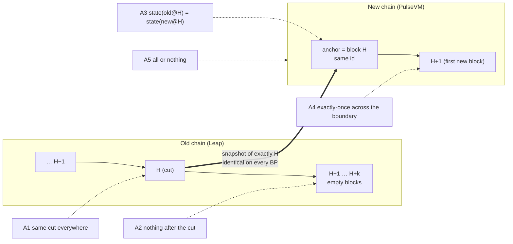

# Atomicity: what we claim, and how each claim is proven

A cutover keeps the **same chain_id**, so a transaction signed for the old chain is also
validly signed for the new one. That is what makes the switch instant for wallets,
exchanges and bots, and it is also why the cut has to be **atomic**. Every transaction
lands on exactly one side of the boundary, exactly once, and the state on both sides of
the boundary is the same state.

This document breaks "atomic" into five properties, names the evidence for each, and
records the rehearsal that produced that evidence. Every check is automated: it is either a
ceremony gate (the ceremony aborts if it fails) or a tool in [`tools/`](tools/) whose
output is kept as evidence.



| # | Property | Why it matters | Evidence | Kind |
|---|---|---|---|---|
| **A1** | **Same cut on every producer**: every BP snapshots the same block H, byte-for-byte | Validators that import different states fork on the first block | `schedule_at_h` pins the snapshot to H's block id; each BP's journal records the file name `snapshot-<id of H>.bin`, its sha256 and 19–21 table fingerprints. All BPs must agree | gate + cross-BP comparison |
| **A2** | **Nothing lands after the cut**: zero transactions in H+1 … pause | Anything after H is on the old chain but not the new one, so it silently disappears | Writes close `freeze_lead_blocks` before H; the **burn-off audit** reads every block from H+1 to the pause and aborts on any transaction (fail-closed: an unreadable block also aborts) | gate |
| **A3** | **Same state on both sides**: accounts, permissions, keys, contracts (code and ABI hash) and table rows on the new chain at H equal the old chain at H, *for the state the diff surveys* (seeded accounts, every contract found, every scope of every ABI table). Not yet a whole-state commitment: see Known limits | Proves the import neither lost nor altered anything | `tools/state-diff.mjs`: byte-exact diff of the paused old chain against the new chain **before its first new block**, run on every BP by the `post_ignite` hook. Plus dual import with identical fingerprints (VERIFIED gate) | tool on every BP |
| **A4** | **Exactly once across the boundary**: a transaction executed before the cut does not execute again after it; one signed before but sent after executes once | Same chain_id makes pre-cut signatures valid on the new chain, so a replay would be a double spend | `tools/replay-canary.mjs`: pre-signs transfers with a long expiry, sends half to the old chain before the freeze, then after LIVE sends **all of them twice** to the new chain. Checks the receiver's balance delta equals the held half exactly. Plus app-level reconciliation (HFT and perps bots: 0 duplicates, every accepted transaction accounted for) | tool |
| **A5** | **All or nothing**: either every producer moves to the new chain or the old chain carries on untouched | Half a network on each chain is a fork | Nothing user-visible changes before LIVE; any gate failure → `ABORTED` → the producer resumes the old chain (proven: run 1 aborted on all 5 BPs and all resumed). The public edge flips only `on_live` | gate + rehearsal |

## Evidence from the 5-BP rehearsal

Rehearsal setup: 5 BPs on 5 continents, each running a Leap 5.0.3 producer, a Metal
validator and a public TLS API edge (nginx on three, HAProxy on two). Apps write through
the edges the whole time: a 0.5 s transfer bot, a perps DEX order bot, an oracle feeder
and a keeper. Full timelines are in the [README](README.md#multi-producer-cutover-5-bps-5-continents).

### Run 5: all five properties checked in one ceremony (2026-09-28, cut at H = 6220)

| # | Result | Evidence (per BP, all 5 identical) |
|---|---|---|
| **A1** same cut | ✅ **5/5 identical** | cut block `0000184cbaf7c1cd…` at 6220 · snapshot sha256 `5e315ecb4943b693…` · 19-table fingerprints identical · PulseVM anchored on the same block id `0000184cbaf7c1cd…` |
| **A2** nothing after the cut | ✅ **0 transactions** | burn-off audit: 62 blocks from H+1 to the pause, 0 transactions, on every BP, with four bots still hammering the API edges (writes closed at H−24) |
| **A3** same state | ✅ **identical on the surveyed state, 5/5** | `state-diff`: old chain (paused at 6282) vs PulseVM at **exactly 6220**, before its first new block. 19 accounts (permissions, keys, privileged flag), 5 contracts (code hash + ABI hash), 32 table scopes (every row as raw bytes). State digest `c21764756abb1080…` on both sides, on every BP |
| **A4** exactly once | ✅ **0 replays, 0 losses, 0 duplicates** | `replay-canary`: 10 transfers executed on the old chain before the cut were re-sent twice to PulseVM → **all 20 attempts rejected** (`duplicate tx`: the imported state carries the recent-transaction dedupe set). 10 transfers signed before the cut but held → **executed exactly once**, second sends rejected; receiver delta = exactly 10 transfers. Perps order bot: 483 cycles, **0 duplicate orders**, every order admitted before the cut is on the book |
| **A5** all or nothing | ✅ | every BP stayed on the old chain until its own LIVE gate passed; run 1 of the same rehearsal aborted on all 5 BPs (transactions leaked past H) and all 5 resumed the old chain automatically |

Timeline (bp1, UTC): ARMED 23:54:34 · FROZEN 23:56:47 · SNAPSHOTTED 23:57:32.6 · VERIFIED 23:57:32.6 ·
IGNITED 23:57:45 · LIVE 00:05:59.5. All five BPs hit each transition within 1.5 s of each other.

> [!NOTE]
> The long gap between IGNITED and LIVE in run 5 is an operator error, not the protocol: the
> `post_ignite` hook shipped without its execute bit, so no heartbeat reached the new chain. That
> left every BP holding the new chain at exactly H for 8 minutes, which is when the A3 state
> diff was taken; the heartbeat was then sent by hand. Writes stayed frozen (HTTP 503) the whole
> time: 1,103 refused writes on the HFT bot, none lost. Runs 2–4 had a write gap of ~72 s.

> [!NOTE]
> "Admitted" on PulseVM means accepted into the mempool, not executed. One perps order per run (runs 4 and 5)
> was admitted **after** LIVE and never executed. That is a post-cut mempool/execution
> behaviour, not a boundary loss: nothing admitted by the old chain was lost, and nothing
> crossed the boundary twice.

The full per-BP evidence (journals, snapshot hashes, `state-diff` reports, canary transcript,
bot ledgers) is archived with the rehearsal notes.

### Earlier runs of the same rehearsal

| Run | Properties exercised | Outcome |
|---|---|---|
| 1 | A1, A2, **A5** | identical snapshot on all 5; 3 transactions leaked into H+1 → **every BP aborted and resumed the old chain** (the gate working as designed); led to `freeze_lead_blocks` |
| 2 | A1, A2 | LIVE on all 5; identical fingerprints and anchor id; balances continuous |
| 3 | A1, A2, apps | LIVE unattended through public edges; surfaced a mempool bug in the plugin build (fixed upstream, fork rebuilt) |
| 4 | A1, A2, apps | LIVE with a perps DEX, oracle and keeper; 0 duplicate orders; 79/79 transfers landed |
| 6 | **A1–A5, unattended, one public URL** | all 7 evidence values agreed 5/5 on mission control; `state-diff` ran automatically at H = 8539 on every BP: identical, digest `df0f4017e7ba97bc…`; replay canary exactly-once (0 pre-cut replays accepted, 10/10 held landed once) |

## Known limits (independent review, 2026-09-29)

An independent read-only review of this repository, the installer and the rehearsal evidence found that the
rehearsal proves the failure classes above are real and catchable, but **not yet** that a 37-producer mainnet cut
is safe. Open items, most severe first:

| # | Limit | Why it matters |
|---|---|---|
| 1 | **No fleet-wide authority boundary.** A producer's local abort still resumes the old chain, even if other producers have already ignited. | A partial abort can split the network. Needs source fencing and a durable "target authorized" state that forbids unilateral resume. |
| 2 | **API mode does not enforce exact H**, and a restarted run can fall back to a later snapshot. | An API provider could serve a different cut than the producers. |
| 3 | **Coordination is single-key and in-memory.** One coordinator signature arms; the relay loses state on restart; agreement can pass while producers are missing. | Needs a signed immutable manifest, threshold authorization, a durable event log, and a complete roster before arming. |
| 4 | **Shared producer identity.** The fork plugin requires every validator to run the same producer name and key. | Unacceptable for mainnet custody; needs per-validator authoring identity. |
| 5 | **State evidence is narrower than "every account"**: `state-diff` covers the accounts and tables it discovers; fingerprints are 64-bit; both imports use the same importer. | Needs a complete, cryptographic whole-state commitment checked by an independent implementation. |
| 6 | **Crash recovery** (locks, side-effect reconciliation, hook timeouts) is not certified. | A crash mid-ceremony must never produce a later-H snapshot or an accidental resume. |
| 7 | **Validator registration and METAL funding** are not automated or certified. | Every producer needs an accepted, funded validator before H can be scheduled. |
| 8 | **The ~50 s post-LIVE stall** is unexplained. | Clients see timeouts right after the cut. |

These are tracked as the priority list for the next release. The rehearsal results above stand as evidence for what
they measured, and nothing more.

## Reproducing the proof

```sh
# A3 — on any BP after IGNITED, before the first new block (the post_ignite hook does this):
node tools/state-diff.mjs --a http://127.0.0.1:8888 --b http://127.0.0.1:8899 \
     --accounts <accounts to seed discovery> --out state-diff.json

# A4 — around the ceremony, from any client:
ENDPOINT=https://your-edge KEY=… FROM=acct TO=sink RUN=r5 node tools/replay-canary.mjs prepare
ENDPOINT=https://your-edge … node tools/replay-canary.mjs pre     # before the freeze
ENDPOINT=https://your-edge … node tools/replay-canary.mjs post    # after LIVE
```

`state-diff` needs nothing but Node ≥ 18; `replay-canary` needs `@proton/js`.
