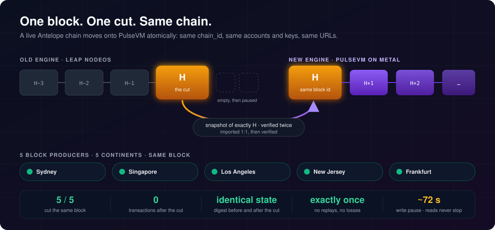
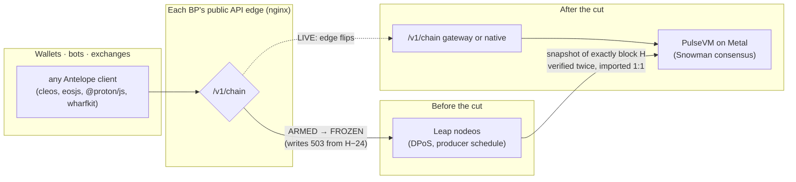
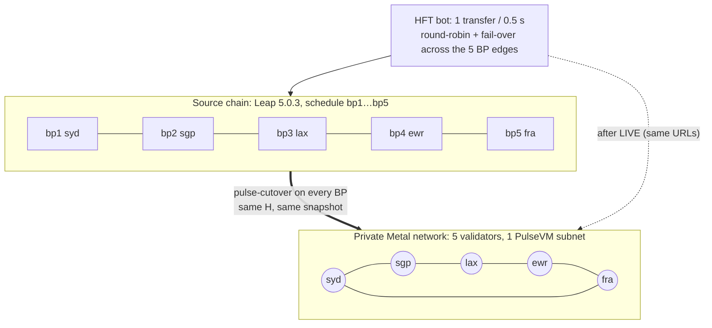
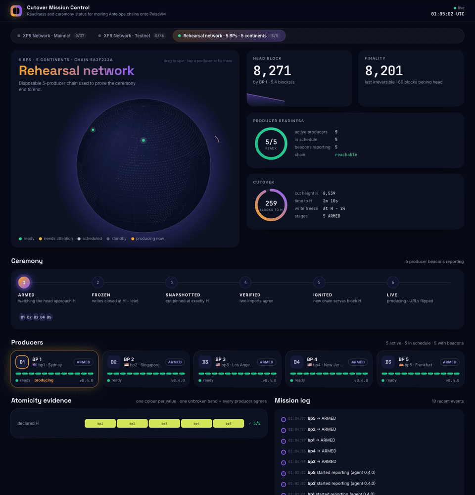
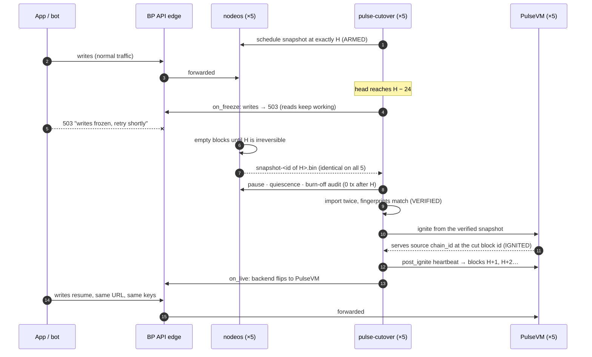
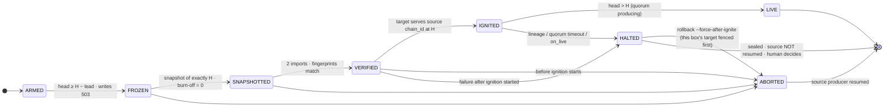

# pulse-cutover

<p align="center"></p>

[](https://pulsevm.dev/guide/migrate-antelope-chain)

*106-second explainer + full methodology and recorded numbers: [pulsevm.dev/guide/migrate-antelope-chain](https://pulsevm.dev/guide/migrate-antelope-chain)*

> **Status: proposed — community project.** This is a **proposed** migration approach, built and rehearsed by XPR Network block producer **protonnz** ([github.com/paulgnz](https://github.com/paulgnz)). It is **not an official Metallicus product and not an announced migration plan.** Core pieces are being contributed upstream to [MetalBlockchain/pulsevm](https://github.com/MetalBlockchain/pulsevm), and the **authoritative migration plan and documentation will come from Metallicus** — this repo is for demonstration, testing, and contribution in the meantime. Any production migration is subject to Metallicus and the relevant network's governance.

pulse-cutover moves a running Antelope chain (XPR Network) onto the PulseVM
engine while keeping the **same public URL, the same chain_id and the same
account state**. One binary drives the ceremony — freeze, snapshot, verify,
ignite, flip — and records every step, with evidence, in a journal you can hand
to anyone. Writes pause for the cut (71–114 s in the unattended rehearsals);
reads keep being served. A producer that aborts before ignition resumes its
existing node; a fleet-wide rollback guarantee is **not yet implemented** (see
the status box below).

> [!IMPORTANT]
> **Status (2026-09-29)**
> - **Proven in rehearsal** (5 BPs on a private Metal network, fork plugin): same cut block, snapshot hash and
>   fingerprints on every BP; zero transactions after H; a symmetric abort where every BP resumed the old chain.
> - **Demonstrated on a sample**: state equality on 19 accounts / 5 contracts / 32 table scopes; a replay canary
>   (10 held + 10 pre-cut transfers).
> - **Not done yet**: fleet-wide all-or-nothing (no authority boundary; a partial abort can split the network), exact H
>   in API mode and on restart, per-validator producer keys, crash recovery, validator registration/funding, and any
>   run on upstream PulseVM v1.0.0 (protocol 45) on Tahoe. Details: [ATOMICITY.md](ATOMICITY.md#known-limits-independent-review-2026-09-29).

> **Block producer? Connect your node in 2 minutes → [docs/OPERATOR-QUICKSTART.md](docs/OPERATOR-QUICKSTART.md) · set up your Metal validator and get your NodeID → [docs/METAL-QUICKSTART.md](docs/METAL-QUICKSTART.md)**
> ```bash
> curl -fsSL https://raw.githubusercontent.com/paulgnz/pulse-cutover/main/tools/beacon-install.sh | sudo bash
> ```
> The running beacon only observes; installing it writes a binary, a readiness-only config, a token and a systemd
> service (it never touches nodeos). It detects your network and account and prints one line to send us.

**New here? → [docs/PROCESS.md](docs/PROCESS.md)**: the whole cutover, step by step, with diagrams: who does what, the timeline around the cut, every gate, what apps see, and how rollback works.

**How atomic is the cut today? → [ATOMICITY.md](ATOMICITY.md)**: five properties, the gate or tool for each, the recorded evidence, and what is still open.

**Watch it live → [Cutover Mission Control](control/README.md)**: readiness of every producer on mainnet, testnet and the rehearsal network, the ceremony as it happens, and cross-producer agreement on the evidence (live at [control-rehearsal.protonnz.com](https://control-rehearsal.protonnz.com)).

**Want to help test? → [TESTING.md](TESTING.md)** — rehearsals never touch
production, take about 40 minutes, and give you operational familiarity before
any real event (plus credit for every setup you help us support).

**Using an AI agent (Claude Code etc.) to operate this? → [AGENTS.md](AGENTS.md)**:
the ten rules, the producer procedure step by step, the hook contract, how to prove
atomicity, and the evidence to hand back.

## At a glance



| What stays the same for users | How it is proven |
|---|---|
| **chain_id** — signatures, wallets and keys keep working | target must report the source chain_id, a height ≥ H and the same block id at H before anything flips (rc.6) |
| **Accounts, permissions, contracts and table rows** | snapshot imported twice by the same importer; 19–21 table fingerprints must match. `state-diff` compares a discovered sample against the old chain; a whole-state commitment is still open |
| **The URL** | producer mode: the edge swaps its backend at `on_live`. API mode: the flip happens before the FLIPPED/LIVE transitions |
| **Nothing is lost at the boundary** | burn-off audit: zero transactions allowed after the cut, or this producer's ceremony aborts and resumes its old chain (not fleet-wide) |

**Proven so far** (rehearsals, never mainnet):

| Rehearsal | Result |
|---|---|
| Single node, API-provider mode, live XPR testnet | **22/22 LIVE**, 99.8% read availability, 0.75 s flip |
| History (`/v2`) continuity via hyperion-rs + federating router | one URL serves pre- and post-cut history |
| **5 block producers on 5 continents** (Sydney · Singapore · Los Angeles · New Jersey · Frankfurt) | **LIVE on all 5 in runs 2–6** (run 1 aborted on all 5, as designed): byte-identical snapshot at exactly H, identical fingerprints, 0 post-cut transactions. Journal write gaps ≈ 243, 72, 71, 553 and 101–114 s; runs 2 and 5 needed a manual step, runs 3, 4 and 6 were unattended ([details](#multi-producer-cutover-5-bps-5-continents)). Fork plugin on a private network, one shared producer key |
| **Atomicity evidence** ([ATOMICITY.md](ATOMICITY.md)) | runs 5 and 6, 5/5 BPs: identical state digest on the sampled state, 0 transactions after the cut, pre-cut transactions rejected as duplicates on the new chain, 10 held transfers executed once. A5 (fleet-wide all-or-nothing) not proven |
| **A live perps DEX + oracle + HFT bot across the cut** | the migrated perps contract kept trading on PulseVM unchanged; 0 duplicate orders; the oracle never went stale; the sampled transfers reconciled on the fixed build. Some orders admitted after LIVE never executed (admission is not inclusion) |

---

## Start here — the operator walkthrough

Six steps. Every step is one copy-paste block, what you should see, and what
to do if you don't. Plain English throughout — anything in *italics* on first
use is defined in the [Glossary](#glossary).

### Step 0 — what you need

- **A box**: a spare Ubuntu 20.04, 22.04 or 24.04 server, or your existing node box.
  The first tool you'll run (`doctor`) is strictly read-only and safe anywhere,
  including production. The later steps (install + rehearsal) belong on a
  spare/test box.
- **Rough specs**: 4+ cores, 16 GB RAM, 50 GB+ free disk. Don't measure by
  hand — `doctor` checks all of it and tells you exactly what's missing.
- **A running nodeos** on that box (native or docker, both fine), synced to
  the chain being migrated. For a rehearsal, a testnet node is perfect.
- **Time**: about 40 minutes end-to-end for a first rehearsal.
- **What this touches on your production infrastructure: nothing.** Steps 1–3
  only install tools and stage files. The only moment anything user-visible
  can change is the *flip* stage of a ceremony you explicitly start in Step 4
  — and a rehearsal ceremony runs entirely on the rehearsal box.

### Step 1 — get the tools

**Just want your node on Cutover Mission Control?** One command installs the prebuilt,
checksum-verified binary and a readiness beacon that only observes (it never touches nodeos, its config or
production; installing it writes the binary, a readiness-only config, a token and a systemd service). Try it with `--dry-run` first; it changes nothing:

```sh
curl -fsSL https://raw.githubusercontent.com/paulgnz/pulse-cutover/main/tools/beacon-install.sh -o beacon-install.sh
sudo bash beacon-install.sh --dry-run   # shows what it detected; changes nothing
sudo bash beacon-install.sh             # detects network + producer from your node
```

It ends by printing `token_sha256=…`: send that line to the mission-control operator to be listed. Only the
hash is enrolled and stored by mission control; the token itself is sent (over HTTPS) with every report, which is how
mission control authenticates it. See [control/README.md](control/README.md).

**For a rehearsal or a ceremony,** install the binary itself. Every release ships **static musl binaries**
(x86_64 + aarch64) that run on any supported Ubuntu regardless of glibc. **Don't build from source on a
producing node**: compiling takes minutes of full CPU.

```sh
V=v0.5.0-rc.1   # or: latest
curl -fsSLO https://github.com/paulgnz/pulse-cutover/releases/download/$V/pulse-cutover-x86_64-unknown-linux-musl
curl -fsSLO https://github.com/paulgnz/pulse-cutover/releases/download/$V/sha256sums.txt
sha256sum -c sha256sums.txt --ignore-missing
sudo install -m 0755 pulse-cutover-x86_64-unknown-linux-musl /usr/local/bin/pulse-cutover
git clone https://github.com/paulgnz/pulse-cutover   # for install.sh / cutover.sh and the examples
```

`install.sh` does the same automatically (release binary, sha256-verified) whenever the ceremony manifest
pins no agent artifact; a manifest-pinned binary still wins, fail-closed, in a real event.

**Building from source** (developers, on a non-producing box): `cargo build --release --locked`. The PulseVM
import crates are fetched from a pinned git revision automatically; no second checkout is needed.

### Step 2 — survey the box: `pulse-cutover doctor`

`doctor` reads your box — how nodeos runs, what nginx/haproxy serve, disk,
ports — and gives a per-mode verdict. It never writes, restarts, or changes
anything.

```sh
pulse-cutover doctor
```

You should see a table like this (real output from our rehearsal box,
trimmed):

```
pulse-cutover doctor v0.2.0 — api-cutover-test (2026-08-21T08:31:45Z)

HOST
  os                     Ubuntu 24.04 (x86_64, Linux 6.8.0-137-generic)
  cpu                    8 x AMD EPYC-Genoa Processor
  ram                    15.2 GB
  disk /                 265 GB free / 300 GB
  systemd / docker       yes / yes

NODEOS (source chain — yours, untouched)
  runtime                docker container `nodeos` (nodeos:5.0.3)
  chain api              http://127.0.0.1:8888
  version                v5.0.3
  chain_id               71ee83bcf52142d61019d95f9cc5427ba6a0d7ff8accd9e2088ae2abeaf3d3dd
  head                   401616025
  producer_api           enabled
  state_history          no

WEB EDGE (nginx)
  version                nginx/1.24.0 (Ubuntu)
  route _                /v1/chain/ -> 127.0.0.1:8888 (upstream pulse_v1_backend)
  ...

VERDICTS
  bp        READY
  api       READY
  hyperion  READY
```

**You should see: `READY` for the mode you plan to run** (`bp` for block
producers, `api` for RPC providers — see [Which mode am I?](#which-mode-am-i)).

**`NEEDS` with a list** is normal on a first run. The common ones:

| doctor says | it means | fix |
|---|---|---|
| `producer_api_plugin (localhost-bound)` | the ceremony takes its snapshot through nodeos' producer API, and yours doesn't have it on | add `plugin = eosio::producer_api_plugin` to your nodeos config, restart nodeos. Keep it bound to 127.0.0.1 — it can pause your chain, so it must never be public |
| `a running, synced nodeos ... serving /v1/chain/get_info` | no nodeos answered on this box | start your node, or run doctor on the box that has one |
| `50GB+ free disk` | the snapshot + new chain need room | free up or mount disk |
| `source.stop_cmd must be declared` | doctor couldn't work out how to stop your nodeos (no systemd unit, no docker container) | you'll add a `stop_cmd` line to the manifest in Step 3 |

**`UNSUPPORTED`** means we genuinely can't drive your setup yet (e.g. apache
or caddy on the public edge, kubernetes-managed nodeos). The verdict says
exactly why. Jump to Step 5 and send us the report bundle — that is literally
how setups get added.

### Step 3 — stage everything: `./install.sh`

One command installs and configures every piece the ceremony needs. It does
**not** touch your running nodeos and does **not** change any public traffic.

It needs a *manifest* — a `ceremony.json` file saying which chain, which
target, and which pinned binaries (its shape is shown in
[the manifest section](#the-ceremonyjson-manifest) below). Where it comes
from:

- **Testing with us**: ask in the
  [Telegram group](https://t.me/+N1mAvoUDbtVmNTBh) for the current rehearsal
  bundle — the manifest plus the prebuilt, sha256-pinned binaries it refers
  to. (Every underlying knob is documented, field by field, in
  `examples/ceremony-api.toml` and friends.)
- **A real event**: the ceremony coordinator publishes one manifest and
  every operator uses the same file.

```sh
sudo ./install.sh --mode api --manifest ceremony.json
```

It re-runs `doctor` first and refuses, with reasons, if the box isn't ready.
Discovery supports specific layouts (see Step 2 and the support matrix), and some
files are written before every check has run, so a refusal can leave a partial
install behind: fix the reason and re-run. On success it ends with the
ARMED-READY banner — this one is from our rehearsal box:

```
============================================================
 ARMED-READY (mode: api) — installed, verified, staged.

 Doctor:  survey + per-mode verdicts in /root/api-cutover/doctor.json
          flip scripts templated from the detected nginx layout
          source stop: systemctl stop nodeos
 Source:  nodeos at http://127.0.0.1:8888 serving 71ee83bc... (untouched)
 Target:  metalgo-pulse tracking subnet 2QziKVhwqMh7tE41Pm5d7Wyg4CL9fFPDEsjtq8w9Z9zNfnvpNL
          NodeID NodeID-P5i8jjoZ2yepjXru6GqLVKjgMMtb96V3k
          chain i54aDguQgAHV2PqDbQPUKm9mURqbwJHoofb5ewyYuAf49d3Ng: waiting for the
          verified snapshot at /root/api-cutover/snapshot-cut.bin (absent by design)
 Public:  nginx /v1/chain -> nodeos:8888 (flip staged, NOT flipped)

 What happens at H (run: ./cutover.sh --manifest ceremony.json):
   1. agent watches the source chain to the freeze height
   2. snapshot via your nodeos producer_api at ~finality
   3. sha256 + dual-import 19-table fingerprint verification
   4. PulseVM ignites from the verified snapshot (same chain_id)
   5. /v1 URL flips to PulseVM + health check   <- only visible step
   6. YOUR stop command retires nodeos (reads never gapped)
============================================================
```

Note the last block: it tells you, before anything happens, exactly what the
ceremony will do. Re-running `install.sh` before a ceremony starts re-verifies and
converges instead of duplicating; don't re-run it during a ceremony.

**If it didn't:** every refusal prints the precise reason and the fix (missing
plugin, stale snapshot file, no `/v1` route in nginx pointing at your nodeos,
...). If the reason doesn't make sense, run `pulse-cutover doctor` for the
full survey, or go to Step 5 and send us the bundle.

### Step 4 — run the ceremony: `./cutover.sh`

In a real event you run this when the coordinator says go. In a rehearsal you
run it whenever you like:

```sh
./cutover.sh --manifest ceremony.json
```

It first checks the manifest against the live chain and refuses to start if
anything is off. Then you watch the states scroll by — this is the real output
of a recorded rehearsal against the live XPR testnet:

```
ceremony starting — journal: /root/api-cutover/journal.jsonl
(the source chain stays authoritative until the last step; ^C + './cutover.sh abort' is always safe before FLIPPED)
[ARMED]       watching the source chain; preflight passed.
  [2026-08-21T03:16:19.995Z]    ARMED {"blocks_to_h_final":240,"head":401579134,"lib":401578805}
  [2026-08-21T03:17:50.298Z]    ARMED {"blocks_to_h_final":72,"head":401579302,"lib":401578973}
[FROZEN]      the freeze height is final on the source chain — taking the state snapshot next.
[SNAPSHOTTED] state snapshot cut + pinned to one exact block.
[VERIFIED]    snapshot hash + state fingerprints check out; staged for PulseVM.
[IGNITED]     PulseVM is up, serving the SAME chain_id, continuing at the cut block.
[FLIPPED]     public /v1 now answered by PulseVM — this was the only user-visible change.
[LIVE]        ceremony complete. Source retired. Same URL, same chain, new engine.

LIVE. Evidence journal: /root/api-cutover/journal.jsonl
```

That output is from a single API-provider box on an older build. Its banner "abort is always safe before
FLIPPED" is outdated: in every mode ignition precedes FLIPPED, and from rc.7 an abort is only performed
**before ignition starts**; after that `./cutover.sh abort` refuses (exit 3) and a failure HALTS instead. It
was never a fleet guarantee either: once other producers may have ignited, a local abort that resumes the
old chain can split the network (ATOMICITY Known limits #1).

How long each part takes (recorded, testnet-sized state; a bigger chain
mostly stretches the snapshot and verify phases):

- **ARMED** — until the declared freeze height arrives. Minutes to hours;
  the countdown lines show progress.
- **FROZEN → VERIFIED** — snapshot + verification, ~1–3 minutes.
- **IGNITED** — new engine boots from the snapshot, ~15 seconds.
- **FLIPPED → LIVE** — in API mode the public URL swap happens as part of the
  FLIPPED step (it took **0.75 seconds** across 22 recorded runs; reads never
  stopped being answered); LIVE follows after health checks and the source stop.

**What LIVE means:** exit code 0, your public URL now serves the same chain
from the new engine, and the journal holds the evidence (hashes, block ids,
timings) for every step.

**What ABORT looks like:** the run stops, prints `[ABORTED]` with the reason,
and exits non-zero. Some errors exit non-zero *without* writing `ABORTED` or
finishing rollback, so after any non-zero exit check the journal and the
actual state of nodeos and the edge. On a single box the ceremony changes
nothing public before FLIPPED; before ignition starts the agent aborts and rolls back itself (bp mode:
resumes your producer; api mode: reverts what it changed) and moves the snapshot it staged aside, so the
box is clean for the next run. `./cutover.sh abort` does the same for a stuck/^C'd run (it first stops a
hook the killed agent left running), but only when the journal proves ignition has not started: it
refuses (exit 3, nothing changed) on a missing, corrupt or locked journal, when an orphaned hook cannot be
stopped, or after ignition; and exits 4 if a rollback step failed (the source may NOT be producing).
Each step is journaled as it completes, so re-running after a failure or crash redoes only what is left;
"already rolled back" means the journal proves every step, `on_abort` included, finished.
`--force-after-ignite` (coordinator's fleet-wide order only) first stops this box's target with
`target.stop_cmd` (default `systemctl stop <metalgo_unit> && ! systemctl is-active --quiet <metalgo_unit>`;
set it if your target runs elsewhere or under another supervisor; it runs under `hooks.timeout_secs`, so a
unit with a longer stop timeout counts as a failed fence) and refuses to resume the source if that fails; the
fence runs on every forced attempt, never reused from an earlier one. A rollback records its intent first:
if it dies before finishing, `run` refuses to carry on (`status` shows `rollback_pending: yes`; `unhalt` does
not clear it) until `rollback` is re-run, or, only while no rollback step has completed,
`rollback --cancel-intent --i-understand` withdraws it (journaled). `run` on an ABORTED journal whose rollback
the journal does not prove finished exits 4 ("rollback INCOMPLETE"). In a multi-producer
event a local abort is not yet coordinated with the rest of the fleet. An aborted rehearsal is a
*useful* rehearsal: go to Step 5.

### Step 5 — share the evidence: `pulse-cutover report`

Whether it went LIVE or ABORTED, one command packs everything we need to
debug your rehearsal or add support for your setup — with secrets scrubbed:

```sh
pulse-cutover report
```

Real output (trimmed):

```
== pulse-cutover report bundle ==
  pulse-cutover-report-api-cutover-test-20260821-083145.tar.gz (28890 bytes)
  sha256 5f38ea34c7a1908099bdd63e3526a841b2fa6f1773568ff681223cd0252351fe

files in the bundle:
  - doctor.json
  - doctor.txt
  - ceremony.toml
  - journal.jsonl
  - logs/metalgo-pulse.log
  - logs/nodeos.log
  ...

redactions applied (review before sharing — nothing listed leaves the box unredacted):
      1 x private-key -> [REDACTED-private-key]
```

The sanitizer always runs: private keys, tokens and passwords come out as
`[REDACTED-...]`; chain ids, block ids and hashes are kept (they're the
evidence). The command prints the full file list so you can review before
sharing (`tar -tzf` the bundle). Add `--paranoid` to placeholder hostnames
and IPs too.

Share it (with the printed sha256):

- **Telegram**: [the cutover testing group](https://t.me/+N1mAvoUDbtVmNTBh)
- **GitHub**: a [rehearsal-feedback issue](https://github.com/paulgnz/pulse-cutover/issues/new?template=rehearsal-feedback.md)

That's the whole loop. [TESTING.md](TESTING.md) describes the rehearsal
program — what we're trying to cover and what testers get.

---

## Which mode am I?

One agent, one manifest format, three operator roles — pick with
`install.sh --mode bp|api|hyperion`:

| | **bp** | **api** | **hyperion** |
|---|---|---|---|
| Who runs it | block producer | RPC/API provider | API provider w/ Hyperion |
| What freezes | the chain (writes at API edge) | observed only (LIB ≥ H) | observed only |
| Snapshot | at **exactly H** | at ~finality (R17) | at ~finality |
| What flips | via your hooks: `on_freeze` closes writes, `on_live` flips the edge | `/v1` upstream | `/v1` **and** `/v2` together |
| What continues | production, numbering, chain_id | reads — zero gap | reads **and history** |

- **bp** — you help freeze the chain and become a producer/validator of the
  migrated chain. Writes reject at the API edge while empty blocks carry the
  chain to H; the snapshot is scheduled at exactly the declared block.
  Recorded: real XPR state, cut at exactly H, gap 197.0s.
- **api** — your job is `/v1` continuity: nodeos serving the public URL →
  PulseVM serving the *same URL*. Your nodeos outlives ignition and retires
  *last*, so reads never gap; the flip is a one-line health-gated nginx swap.
  Recorded: live XPR testnet, **99.8% read availability, 0.75s flip, 22/22
  loop runs LIVE**.
- **hyperion** — everything api does, plus `/v2` history continuity: post-cut
  history from local hyperion-rs, pre-cut history from the legacy archive,
  merged behind the same URL — **the URL keeps its memory**. Recorded: one
  public `/v2` call returning post-cut + 3,206 pre-cut rows minutes after the
  cut.

(Recorded evidence for each mode, with what it does and does not prove: [docs/EVIDENCE.md](docs/EVIDENCE.md).)

---

## Glossary

Plain-English versions of every term this repo uses:

- **Ceremony** — one scripted, journaled migration run, from watching the old
  chain to serving traffic from the new one. A rehearsal is a ceremony on a
  test box.
- **Manifest** (`ceremony.json`) — the one file describing a ceremony: which
  chain, the freeze height, which pinned binaries, where things live. In a
  real event everyone gets the same manifest from the coordinator.
- **H / freeze height** — the agreed block number where the old chain stops
  accepting writes. Everything before H migrates; H is the last migrated
  block.
- **The cut** — the exact block (number *and* id) the snapshot was taken at.
  The new chain continues from the cut: same numbering, same chain_id.
- **Snapshot** — nodeos' own binary export of the full chain state (every
  account, balance, contract, table) at one block.
- **Goldens / fingerprints** — checksums of the snapshot's state, computed
  per table. Everyone's snapshot must produce the same fingerprints as the
  published "golden" values — proof we're all migrating the same state.
- **States** — the ceremony's fixed path. `ARMED`: watching the old chain,
  waiting for H. `FROZEN`: H reached/final; writes are over. `SNAPSHOTTED`:
  state exported and pinned to the cut. `VERIFIED`: snapshot hashed,
  imported twice, fingerprints match. `IGNITED`: the new engine is up,
  serving the same chain. `FLIPPED` (api modes): the public URL now points
  at the new engine. `LIVE`: done — new chain producing/serving, old node
  retired. `ABORTED`: this agent stopped and (in bp mode) resumed its old
  producer; whether the old chain is still the real one depends on the rest
  of the fleet (no fleet-wide authority boundary yet).
- **Flip** — the public URL's edge (nginx or haproxy) is swapped so it answers
  from the new engine. (The write freeze before it is also visible to users:
  writes get HTTP 503.) Health-checked,
  instantly revertible. On nginx it's one upstream line + graceful reload;
  on haproxy it's an enable/disable server pair on the admin socket (or the
  same `disabled`-marker swap + reload without one).
- **Edge** — the web server terminating your public URL (nginx or haproxy).
  Doctor detects and maps both; when a box runs both, the manifest's
  `flip.edge` declares which one the ceremony flips.
- **Admin socket (haproxy)** — haproxy's local control socket
  (`stats socket <path> ... level admin` in the `global` section). Lets the
  flip enable/disable backend servers instantly, transactionally, with zero
  reloads — the preferred haproxy flip strategy.
- **Federator** — a small router that keeps one `/v2` history URL answering
  across the migration: old rows from the old archive, new rows from the new
  indexer.
- **Journal** — an append-only file (`journal.jsonl`) the agent writes every
  step to, with timestamps and evidence. Crash-safe: a restarted agent
  resumes from it. It's also the thing you share when something breaks.
- **R-numbers (R1, R10, R12...)** — findings from the design review and the
  rehearsals ([docs/DESIGN.md](docs/DESIGN.md#2-adversarial-review-findings-that-shaped-the-design),
  R13–R23 in [docs/EVIDENCE.md](docs/EVIDENCE.md#findings-r13r23)). When a message cites one, it's pointing at the *reason* a rule
  exists, e.g. R10 = "the producer API can pause your chain, keep it off the
  public internet"; R12 = "a stale staged snapshot must never pin a new chain
  to an old cut".

---

## Multi-producer cutover (5 BPs, 5 continents)

The ceremony that matters in a real migration is not one node — it is every
block producer cutting **the same block**, in different countries, with apps
still writing. We rehearsed exactly that on disposable infrastructure
(2026-09-28/29):






*Recorded live, run 4 at 6× speed ([asciinema cast](docs/media/multibp-cutover.cast)). Each row is one BP's public API edge:
it serves nodeos, answers writes with 503 from H−24, then flips to PulseVM at LIVE. Underneath, three bots keep
writing through those same edges: an HFT transfer bot, a perps order bot and an oracle feeder. The recording ends
inside the ~50 s post-LIVE stall described in field note 10.*

Every box runs a Leap producer **and** a Metal validator, plus nginx as its
public `/v1/chain` edge. Each BP runs its own `pulse-cutover` with the same
declared `H`; nobody coordinates at runtime.

### What happens, in order



### Real timeline (run 3, all 5 BPs within ±1 s of each other)

```mermaid
gantt
    title Run 3: write freeze to LIVE (UTC)
    dateFormat HH:mm:ss
    axisFormat %H:%M:%S
    section Writes
    open on Leap                         :done, 22:59:40, 23:00:13
    frozen at the edge (503)             :crit, 23:00:13, 23:01:26
    open on PulseVM                      :active, 23:01:26, 23:02:00
    section Ceremony
    empty blocks until H is final        :23:00:13, 23:01:02
    verify (2 imports + fingerprints)    :23:01:02, 23:01:03
    ignite (metalgo restart + import)    :23:01:03, 23:01:20
    heartbeat → LIVE → edge flip         :23:01:20, 23:01:26
```



| Run | Outcome | What we learned |
|---|---|---|
| 1 | **ABORTED on all 5** (correctly) | Byte-identical snapshot at H on all 5, but writes froze *at* H: 3 in-flight transfers landed in H+1. The burn-off audit caught it everywhere; every BP resumed the old chain automatically. → added `freeze_lead_blocks` |
| 2 | **LIVE on all 5** | Freeze at H−24: 0 transactions after the cut. Identical fingerprints and head block id on all 5 validators; balances continuous across the boundary. Needed a manual transaction to pass the LIVE gate (write gap ≈ 243 s). → `post_ignite` heartbeat |
| 3 | **LIVE on all 5, unattended** | Public API edges + HFT bot: 143 clean 503s during the freeze, **73.5 s client write gap** (journal: 71.8–72.4 s), edges flipped on their own. Surfaced a mempool bug in our PulseVM build (below) |
| 4 | **LIVE on all 5, with a perps DEX live** | Fixed plugin: **79/79 admitted transfers landed** (run 3: 108/193). A perps contract deployed on the old chain kept taking orders on PulseVM with no changes, with 0 duplicates and the oracle within its 120 s window across the cut. New: a **~50 s finality stall right after LIVE** (field note 10) |
| 5 | **LIVE on all 5, A1–A4 checks passed**, with a manual step: mixed nginx + HAProxy TLS edges | The `post_ignite` hook shipped without +x and the ceremony did not stop on it; the heartbeat was sent by hand (write gap ≈ 553 s). State diff at H identical on every BP (sampled state), replay canary passed, 0 duplicate orders. See [ATOMICITY.md](ATOMICITY.md). HAProxy edges froze and flipped via the runtime socket with **zero reloads** |
| 6 | **LIVE on all 5, unattended, one public URL** | Every client used `api-rehearsal.protonnz.com` (DNS across all 5 BPs, real TLS). Write gap 101–114 s; local LIVE times spread over ~13 s. Watched on [Cutover Mission Control](control/README.md): all 7 evidence rows agreed 5/5, the state diff at H ran automatically (identical on the sampled state, every BP), replay canary passed. The post-LIVE stall (note 10) reproduced: 92 expired + 12 timeouts after the flip |

Evidence (journals, fingerprints, snapshot hashes per BP) is kept with the
rehearsal notes and summarized per run in [docs/EVIDENCE.md](docs/EVIDENCE.md#multi-producer-rehearsal-5-bps-september-2026);
the configs are reproducible from `examples/ceremony-bp.toml`.

## Field notes: what real-world rehearsals taught us

Things you only find by running it. Each one is either fixed in this repo, fixed
upstream, or an open item with a workaround.

| # | Finding | Impact | Status |
|---|---|---|---|
| 1 | **Freezing writes *at* H leaks in-flight transactions into H+1** | Those transactions would vanish from the migrated state | ✅ `freeze_lead_blocks` (default 24): writes close before H, cut stays exactly H |
| 2 | **Pause-then-snapshot deadlocks** on Leap 5 (snapshots wait for finality; a paused DPoS chain never finalizes) | Ceremony hangs | ✅ `schedule_at_h`: keep producing empty blocks, snapshot at finality, pause after |
| 3 | **PulseVM builds blocks on demand**; an idle new chain never passes the cut | LIVE gate times out → abort | ✅ `post_ignite` heartbeat hook; flip only `on_live` |
| 4 | **Head time is frozen at the cut** until the first new block, and on any idle PulseVM chain | Clients set `expiration = head_time + 30s`, so transactions arrive already expired | ✅ gateway reports a fresh `head_block_time` when idle (true value in `pulsevm_head_block_time`); ⚠ libraries that take the time of the block 3 behind head (eosjs/@proton/js `blocksBehind: 3`) can still fail the first transaction. Use `expireSeconds ≥ 120` |
| 5 | Our fork build of the plugin **panicked in the mempool while verifying peers' blocks** (`mempool.rs:180`) | Transactions admitted by one validator silently dropped (108 of 193 landed in run 3) | ✅ already fixed upstream ("keep consensus alive when mempool expiry index drifts"); fork rebuilt with it: **0 panics, 79/79 landed** in run 4 |
| 6 | After import the producer schedule is **seeded from node config + genesis `initial_key`**, not from the imported schedule | Every validator must run the same producer name and key | ⚠ open, raised upstream; per-BP identities need the schedule derived from imported state |
| 7 | Legacy `/v1/chain` gateway: cleos 5 `send_transaction2`, and `EOS…` vs `PUB_K1_…` key spellings in `get_required_keys` | "Invalid params" / "irrelevant signatures" | ✅ fixed in the gateway; the native `/v1/chain` in PulseVM avoids this layer |
| 8 | Dependent transactions sent back to back can reach *different* producers out of order | e.g. `issue` before `create` lands | ✅ app/deploy scripts: wait for inclusion before a dependent action |
| 9 | A private Metal network needs a custom network id (not `local`) for a custom genesis; old SDKs build Etna-invalid P-chain fees | Can't stand up the testbed | ✅ network id 88888 + `custom` HRP; metalgojs (Node ≥ 20) |
| 10 | **~50 s finality stall right after LIVE** (run 4): blocks H+1…H+4 accepted within 5 s, then nothing accepted for 50 s while all 5 metalgo nodes were still re-peering after their ignite restarts (readiness passed ~15–45 s after ignite), under 4 bots' worth of backlog | Clients saw timeouts and "expired" for ~40 s after the flip, then full recovery at ~1 block/s | ⚠ open. Not seen in run 3 (lighter load). Mitigations to test: gate LIVE on *every* validator's readiness, not just local head > H; restart-less ignition (load the snapshot on chain retry instead of restarting metalgo); ramp traffic after the flip |
| 11 | Imported chains log `onblock failed … resource usage row is missing for account pulse` on every block | None for contracts without `onblock` logic (the perps contract has none) | ⚠ open upstream item: the importer should seed the system account's resource row |
| 12 | The perps writer's 750 ms read-back called 94 orders "admitted, not landed"; 93 were on the book, placed just outside the window by 5-producer propagation | Would have reported phantom drops | ✅ reconcile against a final chain read, not only a read-back timer |
| 13 | A HAProxy flip done only through the runtime socket was **undone by a later `systemctl reload`** (for a cert change): HAProxy re-read `haproxy.cfg` and quietly served the retired chain again | A routine config reload after the cutover silently points users at the old chain | ✅ the flip hook now also persists the swap to `haproxy.cfg` (validated), as pulse-cutover's generated scripts already do; `abort` restores both |
| 14 | Readiness checks judged by pre-ceremony rules during the ceremony (staged snapshot "present", validator "not running" while restarting) | Mission control showed every BP "needs attention" mid-ceremony | ✅ beacon checks are phase-aware |

## Building apps that survive a cutover

What a bot, wallet or exchange integration should do. All of this was
exercised by the rehearsal bots.

- [x] **Treat HTTP 503 during a migration as "hold", not "failed"**. A 503 at the edge means the write was not accepted, so retry with a *freshly built* transaction. If the outcome is ambiguous (timeout, no response), first reconcile: look the original transaction up and check your application state. Re-signing creates a new transaction id and can repeat a business operation whose first attempt did land.
- [x] **Fail over across several BP endpoints.** During run 3 every edge answered reads throughout; writes resumed on all of them at the same moment.
- [x] **Use `expireSeconds` ≥ 120**, and don't derive expiration from an old block (finding 4).
- [x] **Confirm inclusion, not just acceptance.** On PulseVM a gateway "admitted" response means accepted into the mempool; read your state back (or check the block) before treating it as final.
- [x] **Oracle-driven apps**: the chain clock jumps forward by the freeze length at the first new block. Contracts with a staleness window (e.g. 120 s) will see the last pre-freeze price as stale until a fresh one lands, so **push a fresh oracle update as the first post-cut write**. Liquidations and funding that are gated on freshness pause safely in the meantime.
- [x] **Nothing keyed on block numbers breaks**: heights continue at H+1, and the chain_id and keys are unchanged.
- [x] **Contracts move as-is.** The perps contract, its oracle and token were deployed on the old chain with plain `cleos set contract` and kept working on PulseVM after the cut: orders placed, cranked and cancelled with no contract or bot changes.
- [x] **Expect a short, bumpy restart.** Budget for about 1–2 minutes of 503s plus up to a minute of slow confirmations right after the flip (field note 10), and make your bot's retry loop tolerate both.

**Measured across the cut (run 4):**

| App | Before the cut | During the freeze | After the flip |
|---|---|---|---|
| HFT transfer bot (0.5 s) | 309 executed, ~30 ms | 140 × HTTP 503 from all 5 edges | 79 admitted, **79 landed**; 57 expired + 31 timeouts during the stall |
| Perps order bot (place → crank → cancel) | 293 orders, all landed | 21 rejected (503), 2 landed just before the cut | 16/17 landed on PulseVM; **0 duplicate orders** (TAPOS double-apply check) |
| Oracle (BTC, 120 s staleness limit) | fresh | newest price aged to ~72 s | fresh again within seconds of the flip; **never stale**, so liquidations and funding never paused |

## How it works (the builders' half)

Everything below is reference detail. You do not need it to rehearse.

### The state machine



On its own the agent reaches `ABORTED` only **before ignition starts**; for this agent rollback is
resuming its source producer. The one other way in is an operator's `rollback --force-after-ignite`
on the coordinator's fleet-wide order, from `HALTED`, after this box's target was fenced
(`target.stop_cmd`); the beacon reports that ABORTED as `forced_rollback`. From the moment ignition starts (journaled first), any failure goes to a durable
`HALTED` instead: nothing is rolled back and the source is never resumed (`unhalt --i-understand` to
clear). That is the local point of no return. There is no fleet-wide "target authorized" state yet,
so one BP aborting before its ignition cannot know whether another has ignited (ATOMICITY Known
limits #1; design in `docs/DESIGN-authority-boundary.md`).

Per-mode ceremony:

```
bp        ARMED → FROZEN → SNAPSHOTTED → VERIFIED → IGNITED → LIVE
api       ARMED → FROZEN → SNAPSHOTTED → VERIFIED → IGNITED → FLIPPED → LIVE
hyperion  ARMED → FROZEN → SNAPSHOTTED → VERIFIED → IGNITED* → FLIPPED† → LIVE
          * + hyperion-rs hydration gate   † flips /v1 and /v2 in one stage
```

- **ARMED** — preflight, watch the source chain head until freeze height `H`.
- **FROZEN** — writes are closed at the edge before H (`freeze_lead_blocks`). With
  `schedule_at_h` the source keeps producing empty blocks through H to finality and is
  paused only after the snapshot; the cut is pinned by height *and block id*.
- **SNAPSHOTTED** — nodeos `create_snapshot`, hard-asserted to be *of the pinned cut*.
- **VERIFIED** — streaming sha256 + the 19-table state fingerprints computed by
  importing the snapshot into **two fresh arenas** (two runs of the same importer) through the exact
  code path a PulseVM node boots with (`pulsevm_snapshot_import`); compared
  against pre-published goldens (multi-BP) or captured with provenance (rehearsal).
- **IGNITED** — verified snapshot staged into the pre-staged PulseVM chain config,
  metalgo (re)started; target must report the **source chain_id, a height ≥ H and the cut's block
  id at H**. Ignition start is journaled before the restart; any failure after it HALTS.
- **LIVE** — local target head keeps advancing for `live_sustain_secs` (default 60) with no gap over
  `live_max_gap_secs` (20); in bp mode `on_live` flips the edge first and must succeed, in api mode the
  flip already happened at FLIPPED. It is still a local check, not all-validator health or inclusion.

Every transition is an fsynced JSONL journal line with timestamps and evidence
(hashes, block ids, fingerprints, durations). A restarted agent resumes from the
journal and re-runs its current step. Crash recovery is implemented but not yet
certified on real boxes: an exclusive journal lock, torn-tail repair (only a fragment
after the last newline; a complete corrupt record is fatal), journaled side-effect
records (staged artifact, ignition start, flips), a durable HALTED, and hooks run in
their own process group with a deadline (`hooks.timeout_secs`). A Linux fault-injection
run (real systemd, stubbed nodeos and metalgo) passed on rc.10
([docs/EVIDENCE.md](docs/EVIDENCE.md#linux-fault-injection-rc9-and-rc10)); none of it has
been exercised against real chain services or a fleet yet (ATOMICITY Known limits #6).

### Commands

```sh
pulse-cutover run    --config ceremony.toml
pulse-cutover loop   --config ceremony.toml --runs N
pulse-cutover status --config ceremony.toml
pulse-cutover verify --snapshot snap.bin [--cpu-scale 143] [--golden g.txt | --capture g.txt]
pulse-cutover doctor [--json]                       # read-only environment survey + verdicts
pulse-cutover scan-contracts snap.bin [--json]      # stubbed-intrinsic exposure (advisory)
pulse-cutover report [--paranoid] [--out f.tar.gz]  # sanitized feedback bundle
```

`pulse-cutover <command> --help` prints examples for each.

### API-provider mode (`mode = "api"`)

A producer freezes the chain; an **API provider follows it**. api mode is the
ceremony for the operator whose job is `/v1` continuity:

```
ARMED → FROZEN → SNAPSHOTTED → VERIFIED → IGNITED → FLIPPED → LIVE
```

The state order is deliberately different from producer mode: **the source
nodeos outlives ignition**. Reads must never gap, so nodeos keeps answering
the public URL while PulseVM boots and verifies; the only user-visible step is
the **FLIPPED** transition (nginx upstream swap, health-checked: same
chain_id, head agreeing with the target RPC), and only after that does the
operator's own `source.stop_cmd` retire nodeos. An abort before ignition
touches nothing public. The flip runs after ignition, so a failure at FLIPPED
HALTS (nothing is reverted automatically; nodeos was still running) and the
operator decides; a coordinator-ordered `rollback --force-after-ignite` then
reverts the swap after fencing this box's target.

- No producer pause: the freeze is observed (`LIB ≥ H`), not caused.
- Snapshot via the node's **own** `producer_api` `create_snapshot` (works
  read-only on non-producers; keep it localhost-bound — R10).
- `simulate_freeze = true` rehearses against a live chain that will *not*
  stop: when LIB ≥ H the agent proceeds as if frozen; the journal records the
  actual cut block. api mode today snapshots once LIB ≥ H and accepts its own
  height, so its cut can be later than H: a producer write-freeze does not stop
  empty source blocks at H. Exact-H for API providers is open (ATOMICITY Known
  limits #2); until then an API provider must obtain and verify the exact-H
  artifact rather than rely on its own snapshot.

### hyperion mode (`mode = "api"` + `[hyperion]`)

/v2 history continuity rides the api ceremony: after IGNITED the agent stands up
**hyperion-rs** against the new chain's SHiP (`start_cmd` gets the ceremony's
`{first_post_cut_block}` substituted — an imported chain must index from cut+1,
never from 0), writes the **history boundary file** for the federating router,
and holds until `/v2/health` reports the indexer hydrated (with an *idle-at-cut*
allowance: a chain with zero post-cut blocks reports `Indexer: Warning,
last_indexed_block: 0` and is caught up by definition). The FLIP stage then
swaps `/v2` to the **federating router** (`federator/server.js`) in the same
user-visible moment as `/v1`, and both public gates must go green before the
source may be stopped.

The router serves ONE timeline through one URL: pre-cut rows from the legacy
Hyperion (`LEGACY=` the source chain's public archive — or your own old ES if
you kept full history; same knob), post-cut rows from local hyperion-rs, merged
and paginated across the boundary. See `federator/README.md`.

### bp mode (`mode = "producer"`)

The producer-side ceremony from [docs/DESIGN.md](docs/DESIGN.md): freeze writes at the API edge,
**schedule the snapshot at exactly H** (`freeze_strategy = "schedule_at_h"` —
nodeos writes `snapshot-<block_id(H)>.bin` when H finalizes and the agent picks
it up by that exact name), pause after, quiescence-pin the cut, verify, ignite
as the new chain's producer/validator. Writes close `freeze_lead_blocks`
(default 24) *before* H so nothing in flight lands after the cut; a
`post_ignite` hook gives the on-demand chain its first blocks and `on_live`
flips the API edge (see [Multi-producer cutover](#multi-producer-cutover-5-bps-5-continents)).
`source.quiesce_cmd` exists for
single-node rehearsals against a live-syncing replica (sever p2p to emulate
"every producer paused"); a real multi-BP ceremony does not need it. The
burn-off audit journals every transaction between the cut and the pause head —
in a real freeze those blocks are empty and the audit proves it.

### `pulse-cutover doctor` — detect, don't assume

The 22 recorded ceremonies ran on boxes we built. Your box is not that box —
so the tooling **detects** instead of assuming. `doctor` is a strictly
read-only survey (no restarts, no writes, no flips):

```sh
pulse-cutover doctor          # human table
pulse-cutover doctor --json   # machine JSON (what install.sh consumes)
```

What it detects:

- **host** — OS/version/arch/kernel, RAM, CPU, free disk per relevant mount,
  systemd/docker presence, virtualization;
- **nodeos** — native binary or docker container (both work), the systemd
  unit(s) that exec or docker-wrap it, chain API address, version
  (`server_version_string`), chain_id + head, whether the producer_api
  answers (`/v1/producer/paused` probe: 200 = enabled, 404 = missing plugin,
  401/403 = restricted), state-history plugin on/off;
- **web edge** — nginx, haproxy, apache or caddy. For nginx: the full
  `server_name -> location -> proxy_pass/upstream` map from `nginx -T`
  (this is what the flip templater uses), plus TLS cert paths and expiry.
  For haproxy: the full `frontend (binds, TLS, ACL path rules) -> backend ->
  server` map from haproxy.cfg, per-backend server counts (multi-nodeos
  load balancing is detected, not assumed away), the *admin socket* (a
  `stats socket ... level admin` line — its presence selects the zero-reload
  flip strategy), and whether socat/nc is installed to drive it. If BOTH
  nginx and haproxy are running with routes, doctor reports both maps and
  the verdict asks you to declare `flip.edge` in the manifest;
- **history stack** — legacy Hyperion under pm2 or systemd, its /v2 health;
  Elasticsearch version + heap;
- **PulseVM target** — metalgo binary/node, plugins dir, staged
  pulse-cutover services;
- **ports** — the ceremony's port plan (9650/9651/8899/80/9200/7000/7010/7019)
  vs what is actually listening, and who owns the conflict.

It ends with a per-mode verdict: **READY**, **NEEDS** (a precise list — e.g.
"producer_api_plugin (localhost-bound)"), or **UNSUPPORTED** (a precise
reason — e.g. caddy on the public edge, kube-managed nodeos) plus a pointer
at `pulse-cutover report` so unsupported setups become supported ones.

#### Supported setups matrix

"Detected & handled" means doctor recognises the setup and install.sh generates
the stop/flip scripts for it. It is not the same as qualified: the rehearsed
combinations are nginx and HAProxy edges (native and docker) on Ubuntu 20.04–24.04
with systemd- or script-managed nodeos. Apache, CDN/load-balancer rules in front of
the box, direct-origin access, IPv6 paths and WebSocket/streaming endpoints have
not been qualified and need an adapter plus a rehearsal.

| dimension | detected & handled | detected, NOT yet handled (UNSUPPORTED + explain) |
|---|---|---|
| nodeos runtime | native (systemd unit or bare pid) · docker container | kubernetes-managed |
| nodeos stop/start | manifest `stop_cmd` · derived `systemctl stop <unit>` · derived `docker stop <container>` · **script-managed** (no unit — doctor classifies the parent chain: screen/tmux/cron/nohup-orphan/shell, reports pid + config + data dir + where stdout/stderr go; install.sh generates a reviewed graceful-SIGTERM stop script, and a `[CHANGE]` start placeholder you point at your own start script — we cannot guess it, so we say so) | native nodeos whose management doctor cannot classify at all, in api mode without a manifest `stop_cmd` (NEEDS) |
| public edge | nginx (any layout: named upstreams, direct proxy_pass, TLS server blocks, multiple domains) · haproxy (frontends/listens, TLS binds, named + anonymous ACL path rules, multi-server backends) · nginx AND haproxy together (declare `flip.edge`) · no web server (managed nginx layout staged) | apache · caddy |
| nginx flip | templated byte-exact from the detected `server_name -> proxy_pass` map; refuses if no /v1 route points at your nodeos | hand-minified configs may degrade to fewer detected routes — doctor shows what it saw |
| haproxy flip (socket) | admin-level `stats socket` present: the gateway is pre-staged as a `disabled` server at INSTALL time (the one and only reload), and the ceremony flip is a transactional `enable/disable server` on the runtime socket — zero reloads at H, response-checked, instantly revertible | multi-server backend without a drain decision (NEEDS — see HAProxy notes) |
| haproxy flip (reload) | no admin socket: same pre-staged server; the flip swaps the `disabled` markers in haproxy.cfg, `haproxy -c` validates, then one graceful reload (native `systemctl reload` or docker `SIGHUP`) | same multi-server rule |
| haproxy runtime | native (systemd unit) · docker container (validate via `docker exec`, reload via `SIGHUP`) | — |
| history | legacy Hyperion (pm2 or systemd) noted; hyperion mode flips the detected /v2 route (nginx or haproxy) | no detectable /v2 route in hyperion mode (refuses with reason) |
| OS | Ubuntu 20.04 / 22.04 / 24.04 (20.04 note: the distro's Node 10 is too old for the gateway/federator — install.sh checks for Node ≥ 14 and prints the exact NodeSource one-liner if missing; all staged unit files use systemd-245-era directives only) | anything else (UNSUPPORTED — tell us via `report`) |

### HAProxy notes

HAProxy is common front-of-house for Antelope API providers (several nodeos
boxes balanced in one backend, TLS termination, path routing), so it gets
the same first-class treatment as nginx — and, when the admin socket exists,
a *better* flip than a reload:

**How the flip works.** At **install time** (days before the event),
install.sh adds one line to the backend that fronts your nodeos:

```
server pulsevm-gw 127.0.0.1:8899 check disabled # pulse-cutover: staged flip target, ...
```

validates (`haproxy -c`) and does **one graceful reload**. That is the only
reload in the whole procedure — from then on both servers exist in haproxy,
with the gateway parked in maintenance. At H the generated flip script:

- **runtime-socket strategy** (preferred — picked automatically when the
  config has a UNIX `stats socket ... level admin`): sends
  `enable server <backend>/pulsevm-gw`, checks haproxy's answer (an empty
  response means OK; anything else aborts *before touching your nodeos
  entry*), then `disable server <backend>/<your-nodeos>` — zero reloads,
  takes effect immediately, reverts the same way. The script then persists
  the same swap into haproxy.cfg (validated, not reloaded) so a later
  haproxy restart doesn't quietly fall back to the retired nodeos.
- **cfg-reload strategy** (fallback when there is no admin socket): swaps
  which of the two server lines carries `disabled`, validates with
  `haproxy -c`, then one graceful reload. Note a graceful reload is
  *asynchronous* — the old worker keeps answering until the new one takes
  the listeners — which is fine in a ceremony (the agent's health gate polls
  the public URL for several consecutive good answers) but worth knowing
  when testing by hand. Want the better strategy? Add
  `stats socket /run/haproxy/admin.sock mode 660 level admin` to your
  `global` section and re-run install.sh.

**Multi-server backends (the drain decision).** If the backend that fronts
your nodeos balances **several active servers**, doctor's verdict is NEEDS,
not READY: a single-box ceremony flips only *this box's* backend entry, and
proceeding silently would leave the other servers answering from the old
chain after the cut. Decide first, then re-run doctor:

- **drain**: mark every server that must not take post-cut traffic
  `disabled` in the backend (haproxy's own maintenance mechanism — doctor
  counts only non-`disabled` servers), or
- **fleet flip**: run the ceremony on each balanced box and coordinate the
  flips — every box runs its own install + flip against its own entry.

`backup` servers count as active on purpose: after a flip, failover to a
backup nodeos would silently serve the retired chain.

**Docker-run haproxy** is detected and handled (validate via `docker exec`,
reload via `SIGHUP` to the master). One gotcha the live test hit: bind-mount
the config **directory**, not the single file — `sed -i`/`mv` replace the
file's inode, and a single-file mount pins the container to the old inode so
every reload re-reads stale config. install.sh catches this: after staging
it asks the running haproxy (via the admin socket) whether the staged server
actually exists, and refuses with the fix if not. The containerized test rig
we validate with is in `examples/haproxy-test/`.

**Two edges at once.** A box running both nginx and haproxy (e.g. haproxy
terminating TLS in front of nginx, or a half-migrated setup) makes doctor
report **both** route maps and demand `flip.edge` in the manifest — it will
not guess which edge your users actually reach. `"edge": "auto"` (the
default) only auto-picks when exactly one edge routes /v1 to your nodeos.
Real doctor output from the dual-edge validation box (trimmed):

```
WEB EDGE (nginx)
  version                nginx/1.24.0 (Ubuntu)
  route _                /v1/chain/ -> 127.0.0.1:8888 (upstream pulse_loop_backend)
  ...

WEB EDGE (haproxy)
  state                  running (docker container `pulse-haproxy`)
  version                HAProxy version 2.9.15-e872a3f 2025/03/21 - https://haproxy.org/
  config                 /etc/haproxy/haproxy.cfg
  route fe_pulse_test    *:8081 [if path_beg /v1] -> be_v1 { nodeos 127.0.0.1:8888 }
  route fe_pulse_test    *:8081 [default] -> be_v1 { nodeos 127.0.0.1:8888 }
  admin socket           /run/haproxy/admin.sock (level admin) — zero-reload runtime flip via socat

VERDICTS
  api       NEEDS
            NEEDS: two web edges detected (nginx AND haproxy are both running with
            routes) — set flip.edge = "nginx" or "haproxy" in the manifest so the
            ceremony flips the edge your users actually reach
```

### `/v1`: edge, native or legacy gateway

API mode puts something on `127.0.0.1:8899` for the public `/v1` route to flip to. Which one is set by `gateway.mode` in the manifest:

- **`edge`** (recommended with PulseVM v1.0.0+): the /v1 edge from `artifacts.edge` (`gateway/server.js` in this repo, dependency-free Node). It forwards the 14 `/v1/chain` endpoints the node serves natively (normalizing requests nodeos accepts but the node's parser rejects), polyfills the rest of the Leap 5 `/v1/chain` surface (`send_transaction2`, `push_transactions`, `get_raw_block`, `get_block_header(_state)`, `get_producers`, `get_accounts_by_authorizers`, `get_transaction_id`, …), serves `get_activated_protocol_features` / `get_consensus_parameters` from a capture of the source chain, and proxies `/v1/history/*` to the federator. What cannot be served yet is a nodeos-shaped 501. Values always come from the new chain; history indexes are used only to discover accounts. Full table and upstream asks: [docs/V1-COVERAGE.md](docs/V1-COVERAGE.md).
- **`native`**: a dependency-free pass-through of `/v1/chain/*` to the node's own nodeos-style API (MetalBlockchain/pulsevm #98, at `/ext/bc/<BID>/v1/chain/`) with `Host: localhost` for metalgo's host check. Only the 14 native endpoints answer. `artifacts.gateway` is not needed.
- **`legacy`** (default, unchanged): the translating gateway from `artifacts.gateway`, which turns nodeos-style `/v1/chain/*` calls into `pulsevm.*` JSON-RPC. Needed for PulseVM builds without the in-node API, including v0.7.1.

The flip and revert are identical in all modes: the public route swaps its backend to `127.0.0.1:8899`.

**Edge: capture the at-cut facts.** Run `node tools/capture-static.mjs <source-rpc> /etc/pulse-cutover/static` while
the source nodeos still answers (the installer does it once at install time; run it again during the freeze, before
nodeos stops). Without the capture those two endpoints answer 501.

### `install.sh` internals

`install.sh` runs **doctor first** and consumes its JSON:

- refuses per the doctor verdict — UNSUPPORTED prints the precise reason and
  points at `report`; NEEDS prints the exact missing list (needs the
  manifest or the installer itself satisfies — an explicit `stop_cmd`, a
  declared `flip.edge`, socat — are filtered out, not ignored);
- resolves **which edge the ceremony flips**: manifest `flip.edge`
  (`nginx` | `haproxy` | `auto`, default `auto` = the one edge that routes
  /v1 to your nodeos; refuses if both do);
- templates the flip/revert scripts from the **detected** map — nginx:
  domain -> upstream, byte-exact against your own config files; haproxy:
  backend/server names + the chosen strategy (runtime-socket or
  cfg-reload, see [HAProxy notes](#haproxy-notes)). Your edge is untouched
  until the ceremony's flip stage — except haproxy's one install-time
  staging reload, documented above. Only on a box with no /v1 routes at all
  does it stage the managed nginx layout from the recorded runs. If the
  edge has routes but none reach your nodeos, it refuses and says so;
- defaults `source.stop_cmd`/`start_cmd` from the detected systemd unit or
  docker container when the manifest doesn't declare them;
- runs the stubbed-intrinsic scan (advisory) when a prescan snapshot is
  staged.

Beyond that it installs the agent, PulseVM plugin, metalgo, and (api mode)
the /v1 REST gateway from the manifest's artifacts, each **sha256-verified,
failing closed on a mismatch** (other install paths, such as `tools/metal-install.sh`
and Docker images, have their own, weaker pinning; see docs/METAL-QUICKSTART.md);
extracts any tarball safely (`--no-same-owner`, staging dir); stages the
metalgo/chain configs with the manifest's values; enforces R12 (no stale
staged snapshot); and ends with an ARMED-READY print of exactly what will
happen at H. Re-running it before a ceremony converges rather than duplicating.
It never touches your running nodeos and never flips traffic. It does not yet
generate the full coordination, scheduling and mandatory-hook configuration a
multi-producer event needs.

`cutover.sh` validates the manifest against the live chain, runs the agent,
and streams each state transition in plain language. Exit 0 = LIVE. A non-zero
exit usually means ABORTED (the journal path is printed), but some errors exit
without writing ABORTED or finishing rollback: check the journal and the actual
state of nodeos, metalgo and the edge before assuming the source is authoritative.
`cutover.sh status` and `cutover.sh abort` do what they say.

### The ceremony.json manifest

```json
{
  "mode": "api",
  "ceremony": { "chain_id": "…", "freeze_height": 0, "freeze_margin": 240,
                "simulate_freeze": true, "import_cpu_scale": 143 },
  "source":   { "rpc_url": "http://127.0.0.1:8888",
                "producer_api_url": "http://127.0.0.1:8888",
                "stop_cmd": "systemctl stop nodeos",
                "start_cmd": "systemctl start nodeos" },
  "target":   { "network_id": "tahoe", "subnet_id": "…", "blockchain_id": "…",
                "vm_id": "…", "producer_name": "eosio", "producer_key": "PVT_K1_…",
                "staking_dir": "/root/api-cutover/staking" },
  "flip":     { "public_host": "<public-ip-or-domain>",
                "edge": "auto" },
  "artifacts": { "agent":   {"url": "…", "sha256": "…"},
                 "plugin":  {"url": "…", "sha256": "…"},
                 "metalgo": {"url": "…", "sha256": "…"},
                 "gateway": {"url": "…", "sha256": "…"},
                 "edge":    {"url": "…", "sha256": "…"} },
  "gateway": { "mode": "edge" },
  "paths": { "work_dir": "/root/api-cutover" }
}
```

`flip.edge` picks which web edge the ceremony flips when the box runs more
than one: `"nginx"`, `"haproxy"`, or `"auto"` (default — auto-picks the one
edge that routes /v1 to your nodeos, and refuses to guess if both do).
Boxes with a single edge can omit it entirely.

In a real multi-operator ceremony every operator gets the same manifest from the
coordinator, and H comes from the signed coordinator event (`pulse-cutover await`).
The on-chain msig declaration in the original design was not built; see
[docs/DESIGN.md](docs/DESIGN.md) (§4 and finding R6).

### `pulse-cutover scan-contracts` — stubbed-intrinsic preflight

Since PulseVM's arena-import branch, a contract importing an unserved host
function **loads** (the import gets a stub) but **traps if it ever calls
it**. The exposure is exactly enumerable from the snapshot:

```sh
pulse-cutover scan-contracts snapshot.bin          # at-risk table
pulse-cutover scan-contracts snapshot.bin --json   # machine-readable
```

Parses every code object's wasm import section (wasmparser) and diffs `env`
function imports against the served host-function table (169 names, embedded;
`--served file` to override). **Advisory, never a gate** — a referenced
import is a real code path but not necessarily a reachable one (the
`send_deferred` cluster on XPR testnet is the canonical example: 20+ legacy
contracts reference it, few can still reach it). The ceremony runs this scan
automatically on the **actual cut snapshot** after verification and journals
the table; declare `snapshot.prescan_path` (manifest `.snapshot.prescan_path`)
to additionally scan a staged rehearsal snapshot at ARM time.

### `pulse-cutover report` — the feedback loop

One command produces a sanitized tar.gz with everything we need to debug a
rehearsal or add support for a setup (see Step 5 above for the operator
view).

Collected: doctor JSON + table, ceremony journal(s) and loop metrics, the
staged manifest/config, the last ~200 lines of every relevant service log it
detects (nodeos — native or docker —, metalgo-pulse, pulse-gateway,
hyperion-rs units, federator), the stubbed-intrinsic scan table, agent
version.

**Sanitization is non-negotiable and always on**: private keys
(`PVT_K1_...`, `PVT_R1_...`, legacy WIF), bearer/authorization tokens,
passwords (config values, `user:pass@` URLs, ES credentials) and labeled hex
secrets are replaced with `[REDACTED-<type>]` before anything is written
into the bundle. Chain ids, block ids and sha256 digests are kept — they are
the evidence. The command ends by printing exactly what was redacted and the
full file list so you can review before sharing (`tar -tzf`). Hostnames/IPs
stay by default (so we can talk about your box); `--paranoid` placeholders
them too. The sanitizer is covered by dedicated unit tests with planted fake
secrets — that test suite is the review gate for this repo.

### Loop harness — "it works, with numbers"

```sh
pulse-cutover loop --config ceremony.toml --runs 100
```

Each iteration: `[loop].reset_cmd` returns both sides to a pre-ARM state
(source restored, fresh target chain, staged snapshot removed — R12 enforced
by preflight), then a full ceremony runs with H re-derived from live LIB
(`freeze_margin`). Failures don't stop the loop — they're data, categorized in
the summary. Output: per-run JSONL metrics (`[loop].metrics_path`) + aggregate
mean/median/p95/max for the ceremony gap and every phase duration.

The reference loop deployment (scripts + gotchas from the recorded 22-run
series) is in `examples/loop/`.

### Build

Sibling checkout convention: this repo and `pulsevm-arena-import` (branch
`feat/arena-snapshot-import` of paulgnz/pulsevm) live side by side; the
fingerprint stack is consumed as path dependencies.

```sh
cargo build --release && cargo test
```

### Design docs & trust model

- [docs/DESIGN.md](docs/DESIGN.md): the reviewed design as of rc.11 — review
  findings R1–R12, state machine, config format, trust model, failure/rollback
  table, and the v2 shadow-mirror sketch.
- [docs/EVIDENCE.md](docs/EVIDENCE.md): every recorded rehearsal run (single
  producer, API, hyperion and bp mode, the 5-BP rehearsal, Linux fault
  injection), with what each proves and does not, and findings R13–R23.
- [docs/DESIGN-authority-boundary.md](docs/DESIGN-authority-boundary.md): the
  fleet-wide commit-or-abort design (not implemented).
- [docs/PROCESS.md](docs/PROCESS.md) and [ATOMICITY.md](ATOMICITY.md): the
  process step by step, and what "atomic" means and how far the evidence goes.

`examples/ceremony.toml` documents the full agent config format.

---

## Upstream alignment

> **Cross-validated:** the two verification stacks agree in practice — upstream's #61 pipeline and this project's importer were run against the same XPR testnet snapshot and produced byte-identical state (including row order) on every table both carry, measured with upstream's own `xpr_state_fingerprint` / `xpr_19_table_compare` ([results](https://github.com/MetalBlockchain/pulsevm/pull/61#issuecomment-5485633926)). The upstream tools are the spec. That was a one-time cross-check on one snapshot; it supports using the interim fork path in rehearsals, not a standing guarantee for other snapshots or releases.

Metallicus is building the node-side migration path in
[MetalBlockchain/pulsevm#61](https://github.com/MetalBlockchain/pulsevm/pull/61)
(Chainbase→Arena conversion via a pinned Leap node's SHiP full-state export)
and its companion PRs. pulse-cutover is the operator ceremony *around* a
migration, so the two stacks map onto each other rather than competing:

| Upstream (#61 branch) | pulse-cutover | Relationship |
|---|---|---|
| `tools/xpr-chainbase-export/export.sh` (nodeos→SHiP full-state export) | freeze + snapshot stages (nodeos `create_snapshot` → portable `.bin`) — and `import_backend = "upstream"` drives export.sh itself from that `.bin` | The ceremony feeds the official pipeline |
| `xpr_state_fingerprint` / `xpr_19_table_compare` (whole-state root + per-table SHA-256) | `verify` — dual fresh-arena import + 19-table `DefaultHasher` (64-bit) goldens (fork backend only) | Same goal; equivalence was checked once by the published cross-check below — in upstream mode the ceremony verifies with the official tools |
| `host-function-audit.sh` (Leap registry ↔ PulseVM import map, source-based) | `scan-contracts` (wasm imports of every *deployed* code object vs the served set) | Complementary: theirs finds surface gaps, ours finds real-world exposure |
| five-node runner / EC2 scripts | ignite + flip + hyperion federation (endpoint keeps its memory) | Upstream boots the network; the ceremony keeps operators' public surfaces alive across the cut |

### Import backends

The ceremony has two ways to turn the cut snapshot into PulseVM state,
selected by `[ceremony] import_backend = "fork" | "upstream"`:

- **`upstream` — the official path (#61), the target.** The export must write the `deferred-transactions.json` sidecar (`export.sh --deferred-sidecar`); the agent refuses to verify without it, because it carries the transaction dedupe set that stops pre-cut transactions replaying after the cut. The ceremony drives
  the core team's own pipeline for SNAPSHOTTED → VERIFIED: `export.sh` (a
  pinned Leap replays the cut `.bin` into a SHiP full-state
  `chain_state_history.log`) → `xpr_import_check` (SHiP → Arena checkpoint +
  a manifest binding checkpoint bytes to the source block id) — and
  **verification is upstream's own tooling**: `xpr_19_table_compare` (a
  wire-level nodeos-vs-Arena comparison of all 19 tables; any mismatch fails
  the ceremony, **but only when `compare_bin` is configured**: it is optional
  today and skipped otherwise) plus `xpr_state_fingerprint` (whole-state root —
  journaled, and golden-comparable across operators via `[upstream] golden_state_root`).
  Every artifact is bound back to the ceremony's pinned cut: the export
  manifest's `INPUT_SNAPSHOT_SHA256` must equal the cut snapshot's hash, and
  the checkpoint manifest's `source_block_id`/`checkpoint_revision` must
  equal the pinned cut block id/height. Config: `[upstream]` (work_dir, export_cmd, import_bin,
  compare_bin, fingerprint_bin) — see `src/config.rs` for the documented
  fields and `examples/ceremony-upstream.toml` for a verify-only shape.

  **Ignition from the checkpoint** (PulseVM v1.0.0 + metalgo v1.14.2-tahoe) is on when
  `[upstream] genesis_base` and `[target] create_chain_cmd` are both set (without them the
  ceremony is verify-only and stops after VERIFIED, source resumed). It follows how the
  node actually boots a migrated chain, as found on the stage-2 rig:
  1. *Before VERIFIED* (abortable), the agent fetches the **full** cut block (every
     transaction receipt) from the source with `get_block` (or `upstream.source_block_rpc_url`),
     packs it into the wire `signed_block` itself and requires its computed id to equal the
     pinned cut block id. Upstream's `xpr_attach_source_block` refuses a boundary block with
     transactions and a block emptied of them fails the controller's `transaction_mroot`
     check; the controller accepts the complete block (the Rust packer reproduces the rig's
     accepted anchor byte for byte). It then writes `boot-<cut>.manifest.json` (checkpoint
     manifest + `source_block`), `migration-genesis-<cut>.json` (`genesis_base` +
     `migration_checkpoint_sha256`) and `chain-config-<cut>.json` (`chain_config_base` +
     `migration_checkpoint` + `migration_manifest`), and journals their hashes.
  2. *After the fleet gate, before `ignite_started`*, the hashes are re-checked and
     `create_chain_cmd` runs (`{genesis}`, `{chain_config}`, `{manifest}`, `{checkpoint}`,
     `{genesis_sha256}`, `{cut_height}`). It creates the subnet + blockchain on Metal (the
     coordinator's / validators' job in production, a helper with the local network key on a
     rig) and prints `BLOCKCHAIN_ID=<id>` (and `SUBNET_ID=<id>`); the id is journaled at once
     and a resumed agent never creates a second chain. A failure aborts and resumes the source.
  3. From then on `{blockchain_id}`, `{subnet_id}`, `{chain_config}`, … expand in
     `target.rpc_url` (`…/ext/bc/{blockchain_id}/rpc`), `ignite_cmd` and every hook.
     `target.chain_config_dir` (metalgo `--chain-config-dir`) gets `<id>/config.json`;
     `ignite_cmd` makes metalgo track `{subnet_id}` and restarts it. `ignite_started` is
     journaled before it runs, so any failure from here HALTS (sealed), as for the fork backend.
  4. The target must come up at the cut height with the cut block id (lineage) and the source
     chain_id. The edge reaches the node as `/ext/bc/<id>/v1/chain?route=/v1/chain/<m>`.

  An upstream ignite is **refused for XPR mainnet** while `upstream::ignite_pending_reasons()`
  is non-empty (the signing chain_id is not pinned to the source's, and TAPOS is not
  enforced); on any other chain those reasons are journaled as warnings at every ignite.

  **Rehearsal-only overrides** for the known v1.0.0 gaps (refused at config load for the XPR
  mainnet chain_id and again at ARM if the source turns out to be mainnet; listed by
  `status`, journaled at ARMED/VERIFIED/LIVE, reported by the beacon as the failing setup
  check `rehearsal_overrides`, labeled on mission control):
  - `[upstream] rehearsal_allow_compare_mismatch = ["contract_index_double", "global_property"]`:
    v1.0.0's `xpr_19_table_compare` fails on those two tables (an upstream regression in
    `crates/pulsevm_chaindb/src/history.rs`). The compare still runs and its full output is
    journaled; it passes only if every failing table it names is listed, and any other
    failing table (or a failure naming none) still aborts.
  - `[ceremony] rehearsal_allow_chain_id_change = true`: the target signs with metalgo's
    blockchain id, not the source chain_id; the post-ignition check accepts the different id
    and journals both (without it, that check HALTS). Clients must sign for the target id.

  `examples/ceremony-upstream-rehearsal.toml` is the full rehearsal shape (api mode against the
  live testnet, both overrides).

- **`fork` — the interim bridge (today's default).** Our
  `feat/arena-snapshot-import` branch reads the Leap `.bin` directly and the
  target chain boots via `snapshot_path`; verification is the dual
  fresh-arena import + 19-table fingerprints. It is the default **only
  until the upstream ignition above is rehearsed end to end and the mainnet
  gaps close** (chain_id pinning, TAPOS, the v1.0.0 compare regression); then
  the default flips to `upstream` and the fork path is slated for retirement. Its correctness was established by a **one-time
  published cross-check** against the #61 pipeline — byte-identical state,
  row order included, on every table both implementations carry, measured
  with upstream's own tools
  ([results](https://github.com/MetalBlockchain/pulsevm/pull/61#issuecomment-5485633926)).
  That cross-check is why the fork path needs no standing in-ceremony
  shadow: `[upstream] fork_audit = true` can journal the fork fingerprints
  as a labeled dev/audit extra, but it is off by default, never a gate, and
  documented as a release-validation tool — not an operator step.

Fidelity notes, tracked for **upstream** resolution (not papered over here):
the SHiP export path currently lacks the per-account **sequence counters**
and the transaction **dedupe set** that the `.bin` carries (details in the
[cross-check comment](https://github.com/MetalBlockchain/pulsevm/pull/61#issuecomment-5485633926));
`export.sh`'s completion probe uses `rg`, which minimal nodeos images lack —
an `rg`→`grep` one-line patch is the validated workaround until it lands
upstream.

Legacy knob: `[snapshot] upstream_fingerprint_bin` still runs an
`xpr_state_fingerprint`-compatible binary alongside the fork backend's check
(journaled, advisory, clean no-op when absent) — superseded by the full
upstream backend above, kept for configs that already carry it.
`scan-contracts` (read-only wasm-import audit of deployed contracts) runs
under both backends.

---

## Reproduce our results

The recorded numbers (22/22 api-mode loop runs LIVE, 99.8% read availability,
0.75s flip; bp-mode cut at exactly H, gap 197.0s; hyperion /v2 federation
minutes after the cut) come from rehearsals against the **live XPR testnet**
on a single Ubuntu 24.04 box; the multi-producer numbers come from a
disposable 5-BP Leap chain + private 5-validator Metal network (see
[Multi-producer cutover](#multi-producer-cutover-5-bps-5-continents)). To reproduce: walk Steps 0–5 above, then
`pulse-cutover loop --runs N` with `examples/ceremony-api.toml` (the
`examples/loop/` scripts show the exact reset harness we used). The recorded
runs, with what each proves and does not: [docs/EVIDENCE.md](docs/EVIDENCE.md).

## Testing program

We are building the operator-side confidence for a real migration event, one
rehearsal at a time — different nodeos setups, nginx layouts, history stacks.
**[TESTING.md](TESTING.md)** is the whole program: what a test run involves,
the guarantee that it never touches production, what to share and where, and
what testers get out of it.

## Status & caveats

- Operator tooling v0.5.0-rc.9 (beacon, installers, mission control) — rehearsal-grade; the beacon installer
  pins the latest *released* tag.
  The recorded ceremonies are real but ran the fork plugin (`v0.0.0-arena-mempoolfix.1`
  lineage, metalgo 1.13.5, plugin protocol 43), not upstream PulseVM v1.0.0 (protocol
  45, needs metalgo 1.14.x); no *mainnet* event has run. See the status box at the top.
- Ubuntu 20.04/22.04/24.04 + systemd only; nginx and haproxy traffic flips
  (apache/caddy detected and refused with reasons). `report` bundles are how
  new setups get added.
- Default import backend is still the fork path (`paulgnz/pulsevm`,
  `feat/arena-snapshot-import`), an interim bridge: the official migration
  path (MetalBlockchain/pulsevm#61) is merged, and `import_backend = "upstream"`
  drives it through VERIFIED and can ignite from the checkpoint on PulseVM v1.0.0
  (unit/integration-tested; a full ceremony on real services has not run yet). On
  v1.0.0 that needs both rehearsal-only overrides, and it is refused for mainnet
  (see "Import backends").
- Multi-producer: proven LIVE across 5 BPs with a **shared** target producer
  identity (field note 6). Per-BP producer keys on the migrated chain need an
  upstream change.
- Guide + video: [pulsevm.dev/guide/migrate-antelope-chain](https://pulsevm.dev/guide/migrate-antelope-chain)
- Questions / test bundles: [Telegram](https://t.me/+N1mAvoUDbtVmNTBh) ·
  [rehearsal-feedback issues](https://github.com/paulgnz/pulse-cutover/issues/new?template=rehearsal-feedback.md)
