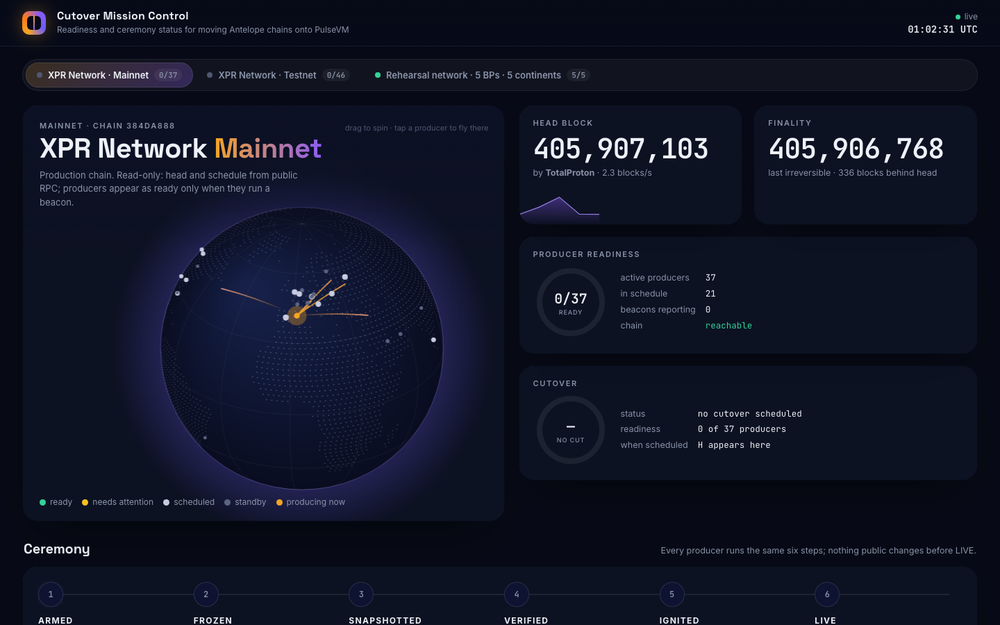
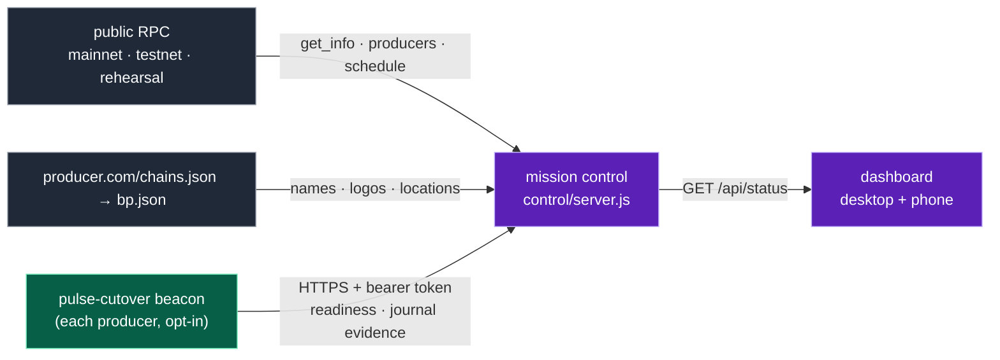
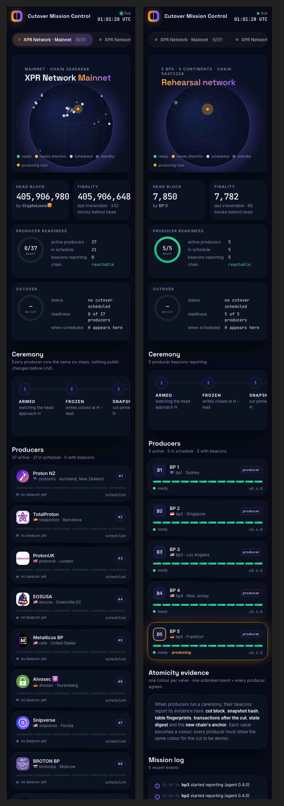

# Cutover Mission Control

A live readiness and ceremony board for every network you care about: XPR mainnet (first), testnet, and
rehearsal networks. Deployed for the rehearsals at **https://control-rehearsal.protonnz.com**.



Run 6 of the 5-BP rehearsal, as seen on mission control (time-lapse):


| What you see | Where it comes from |
|---|---|
| Head, LIB, blocks/s, who is producing, block propagation arcs on the globe | public RPC of each network (read-only, polled every 3 s) |
| Every **active** producer (e.g. 37 on mainnet), vote rank, scheduled vs standby | `eosio::producers` (`is_active`) + `get_producer_schedule` |
| Names, logos, cities, map positions | each producer's `<url>/chains.json` → that chain's `bp.json` (falls back to `/bp.json`) |
| Per-producer readiness checks, ceremony state, agreement of cut id / snapshot hash / fingerprints / state digest | **opt-in beacons**: `pulse-cutover beacon` on each producer's box |

Nothing on this board can change a chain or a node. It reads public data and accepts reports from
producers who choose to send them.



## Run it

```sh
NETWORKS=control/networks.json TOKENS=/etc/pulse-control/tokens.json COORD_FILE=/var/lib/pulse-control/coord.json \
  PORT=8787 node control/server.js
# behind nginx/caddy with TLS; it binds 127.0.0.1 only. The proxy MUST overwrite X-Real-IP with the client address
# (nginx: proxy_set_header X-Real-IP $remote_addr;) — /api/reach trusts that header only from loopback.
node --test control/test/*.test.mjs   # offline test suite (MC_OFFLINE=1, random port, temp config)
```

- **Networks:** `control/networks.json` lists each network's id, label, expected chain_id and public RPC URLs
  (tried in order). `priority` orders the tabs. A network with `"static_producers": true` + `"geo"` (the rehearsal) skips
  the producers table and uses the given locations.
- **Tokens:** `tokens.json` maps `sha256(token)` → `{ "network": "...", "producer": "..." }`. The server never stores a token,
  only its hash, and accepts a report only for the network and producer the token is bound to.
  Issue one: `t=$(openssl rand -hex 32)`; give `t` to the producer (file, mode 600); add `sha256(t)` here. The file is
  re-read automatically.
- **Coordination** (`COORD_FILE`): the relay is an acceptance boundary. A signed event/arm/abort counts as relayed only
  once it is on disk (written to a temp file, fsynced, renamed); if the write fails the server answers 503 and nothing
  changes. A corrupt store stops startup (exit 3) rather than starting empty and forgetting a live event: restore it
  from a backup, or delete it only if no event is live. While an event is active and not aborted, a *different* event
  is refused (409). **Event ids are single-use**, even after an abort. `arm` must carry `event_hash` = sha256 of the
  published event payload (`abort` is checked too when it carries one); `control/coord.mjs` adds it for you.
- **Replay state** (`REPLAY_FILE`, default `replay.json` next to `COORD_FILE`): the last accepted report timestamp per
  server survives restarts, so a captured report can't be replayed after mission control restarts.
- **Operator clear** (identity conflicts): on the mission-control host itself,
  `curl -X POST 'http://127.0.0.1:8787/api/admin/clear-server?net=<net>&producer=<acct>&sid=<sid>'`. Accepted only on
  loopback without `X-Real-IP`/`X-Forwarded-For`, i.e. never through the public proxy (which always sets X-Real-IP).
- **Tokens file reload** is validated before it replaces the current set (a bad edit keeps the old set and logs);
  deleting the file revokes every token.
- No dependencies, Node ≥ 18. The page loads fonts from Google Fonts and the globe's land outline from jsDelivr
  (`world-atlas`); without them it still works, with a plain globe.

## Report from a producer (the beacon)

Add to the ceremony config and run `pulse-cutover beacon --config ceremony.toml` (e.g. as a systemd service):

```toml
[beacon]
url = "https://control.example/api/report"
producer = "protonnz"             # your account, as in the producer schedule
network = "testnet"               # the id in networks.json
token_file = "/etc/pulse-cutover/beacon.token"
interval_secs = 5
```

The beacon is read-only on the box. It checks the source API, producer API, chain_id, declared H, freeze lead,
hooks (exist and executable), that no snapshot is pre-staged, that the validator is running, and free disk. It
summarizes the journal into the evidence every producer must agree on. `--once` prints one report without sending it.



## Security model (what the public dashboard will and won't publish)

The dashboard is public. The server treats every beacon report and every producer-controlled URL as untrusted:

- **Reports** are validated against a strict schema (types, enums for ceremony states and roles, length caps) and
  rejected with 400 otherwise. Only an allow-listed projection is stored and published (`/api/status`, `/api/node`):
  unknown fields are dropped, check details are redacted (paths, URLs, IPs, key-like strings removed), and
  error text is reduced to a short redacted hint: rc.5+ beacons send a sanitized `last_error_class`, older ones the raw
  `last_error`; both are re-redacted (the full error stays in the operator's local journal). `lineage_at_cut`
  (verdict string or `{h, source_block_id, target_block_id, match}`), `profile`, `instance_id` and the `HALTED` state
  are part of the schema.
  Reports older than 5 min, more than 2 min in the future, or not newer than the last one from the same server
  (replay) are refused. Age and silence are judged from the report's own timestamp, not from when it arrived. Each token may send at most one report per 3 s (burst 5).
- **Identity:** servers are keyed by token hash plus the beacon's `instance_id` (one token = one server). The `node`
  label is display only; equal labels are both kept (`api`, `api (2)`). Each server has a public `sid` (one-way hash of
  its key) that pages and `/api/node/<net>/<producer>/<sid>` use, so links always address the exact server. A token
  reporting from a second machine (a second `instance_id`) is kept as a **separate, conflict-flagged** entry: nothing
  is replaced, and the producer is not "prepared" until an operator removes one (see Operator clear) or enrolls each
  machine with its own token. A server is "silent" after max(3 × its interval, 45 s).
- **Outbound fetches** to producer-supplied URLs (bp.json, chains.json, logos, API/Hyperion/AtomicAssets probes,
  p2p TCP probes, known endpoints) resolve DNS first and refuse loopback, private, link-local, CGNAT, multicast,
  documentation and other non-public ranges (IPv4 and IPv6, incl. mapped/NAT64/6to4 forms); redirects are followed
  manually (max 3) and re-validated; responses are size-capped (logos 512 KB); at most 16 probes run at once. The
  connection is **pinned** to the address that passed validation (node:http/https with a fixed `lookup`, SNI and Host
  kept as the hostname), so DNS rebinding between the check and the connect can't redirect a probe inward.
- **/api/reach** dials only the caller's own public IP literal, only port 9651, once per 5 s per IP, 20 in flight.
- **Agreement** is roster-based: the denominator is the producer schedule (or the configured set), stale reports are
  excluded and named, and members without a value are listed as missing (never silently dropped). With **no roster**
  there is no verdict ("no roster"): "everyone who happened to report agrees" is not agreement. Agreement is equality,
  not correctness (a non-zero "transactions after the cut" is flagged even if everyone agrees).
- **Readiness wording:** the dashboard says *prepared* (every preparation check green), never "ready to cut". Each
  server shows five stages: Metal prepared, Beacon healthy, Ceremony configured, Validator admitted (not tracked yet:
  "unknown") and Authorized for an event ("none": the authority boundary is not implemented). Infrastructure health
  counts a Hyperion with failing internal services, or an AtomicAssets API whose chain is not OK, as *degraded*.
- **Manifest** (`/api/manifest`) is preparation metadata only (`"status": "preparation metadata, not a release
  authorization"`): unsigned, not bound to an event.
- **Routing:** the page is served only for app routes (`/<net>`, `/<net>/<producer>`, `/<net>/<producer>/<server>`,
  `/<net>/<producer>/endpoint/<ref>`, where `ref` is the base64url of the canonical endpoint id
  `scheme://host[:port]/path`, so http vs https and `/A` vs `/a` are different endpoints and IPv6 works; old
  `endpoint/<host[/path]>` links still open and are resolved when unambiguous); anything else is a 404. Malformed percent-encoding is a 400, and any
  handler error returns 500 without taking the process down.
- The globe's block arcs are illustrative animation, not measured propagation.
