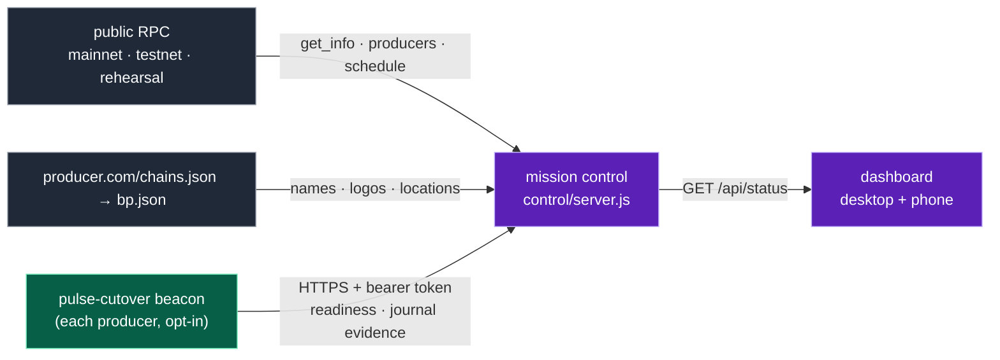

# Cutover Mission Control

A live readiness and ceremony board for every network you care about: XPR mainnet (first), testnet, and
rehearsal networks. Deployed for the rehearsals at **https://control-rehearsal.protonnz.com**.


Run 6 of the 5-BP rehearsal, as seen on mission control (time-lapse):


| What you see | Where it comes from |
|---|---|
| Head, LIB, blocks/s, who is producing, block propagation arcs on the globe | public RPC of each network (read-only, polled every 3 s) |
| Every **active** producer (e.g. 37 on mainnet), vote rank, scheduled vs standby | `eosio::producers` (`is_active`) + `get_producer_schedule` |
| Names, logos, cities, map positions | each producer's `<url>/chains.json` → that chain's `bp.json` (falls back to `/bp.json`) |
| Per-producer readiness checks, ceremony state, agreement of cut id / snapshot hash / fingerprints / state digest | **opt-in beacons**: `pulse-cutover beacon` on each producer's box |

Nothing on this board can change a chain or a node. It reads public data and accepts reports from
producers who choose to send them.



## Run it

```sh
NETWORKS=control/networks.json TOKENS=/etc/pulse-control/tokens.json PORT=8787 node control/server.js
# behind nginx/caddy with TLS; it binds 127.0.0.1 only
```

- **Networks:** `control/networks.json` lists each network's id, label, expected chain_id and public RPC URLs
  (tried in order). `priority` orders the tabs. A network with `"static_producers": true` + `"geo"` (the rehearsal) skips
  the producers table and uses the given locations.
- **Tokens:** `tokens.json` maps `sha256(token)` → `{ "network": "...", "producer": "..." }`. The server never stores a token,
  only its hash, and accepts a report only for the network and producer the token is bound to.
  Issue one: `t=$(openssl rand -hex 32)`; give `t` to the producer (file, mode 600); add `sha256(t)` here. The file is
  re-read automatically.
- No dependencies, Node ≥ 18. The page loads fonts from Google Fonts and the globe's land outline from jsDelivr
  (`world-atlas`); without them it still works, with a plain globe.

## Report from a producer (the beacon)

Add to the ceremony config and run `pulse-cutover beacon --config ceremony.toml` (e.g. as a systemd service):

```toml
[beacon]
url = "https://control.example/api/report"
producer = "protonnz"             # your account, as in the producer schedule
network = "testnet"               # the id in networks.json
token_file = "/etc/pulse-cutover/beacon.token"
interval_secs = 5
```

The beacon is read-only on the box. It checks the source API, producer API, chain_id, declared H, freeze lead,
hooks (exist and executable), that no snapshot is pre-staged, that the validator is running, and free disk. It
summarizes the journal into the evidence every producer must agree on. `--once` prints one report without sending it.


