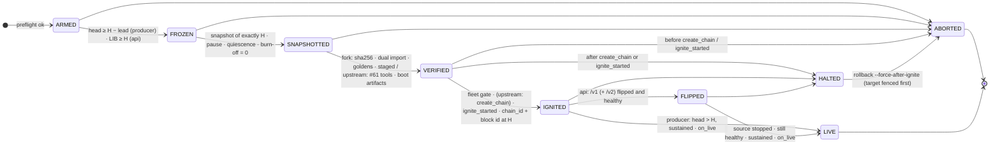

# Design: the pulse-cutover ceremony agent

This is the design of `pulse-cutover`, the agent each producer and API operator runs beside
their nodeos to move a running Antelope chain onto PulseVM at one block, H. It records why the
ceremony is shaped the way it is: the adversarial review that changed the design (the
**R-numbers** that appear in log messages, config comments and the README), the state machine,
the config format, the failure and rollback table, and a sketch of a faster v2.

It describes the code as of **v0.5.0-rc.11**. The first version of this design was written
in August 2026, before the multi-producer rehearsal and several review rounds; where that
version differs from today's code, the code wins and the difference is marked *historical*.

Other documents cover the rest, and this one does not repeat them:

| Document | What it covers |
|---|---|
| [PROCESS.md](PROCESS.md) | The cutover step by step: who does what, the timeline around H, each phase's gate, what apps see |
| [ATOMICITY.md](../ATOMICITY.md) | The five atomicity properties (A1–A5), the evidence for each, known limits, upstream re-qualification list |
| [DESIGN-authority-boundary.md](DESIGN-authority-boundary.md) | The fleet-wide commit-or-abort design (not implemented) |
| [EVIDENCE.md](EVIDENCE.md) | Every recorded rehearsal run, with what it proves and what it does not |
| [EXCHANGES.md](EXCHANGES.md) | For exchanges, wallets and indexers: the head-number step back at the flip, crediting deposits through the federated history, reconciling before re-signing |
| [`examples/*.toml`](../examples/) | Fully commented configs per mode; `src/config.rs` documents every field |

## 1. Scope and design rules

`pulse-cutover` is one Rust binary. Its fork-backend verification imports the snapshot through
the same crates a PulseVM node boots with (`pulsevm_snapshot`, `pulsevm_snapshot_import`,
`pulsevm_chaindb`), so the agent's check and the node's import cannot drift apart. The upstream
backend runs the official MetalBlockchain/pulsevm#61 tools instead (README, "Import backends").

The rules the design keeps to:

1. **Freeze writes, not blocks.** Writes stop at the API edge before H; producers keep making
   empty blocks until H is final (R1, R2).
2. **The cut is exactly H, pinned by height and block id.** Any other height aborts, except in
   explicitly flagged rehearsal modes (R4).
3. **Every node checks its own snapshot.** No trusted snapshot publisher; each operator verifies
   that others match them (R6).
4. **Nothing user-visible before the target is proven.** In producer mode the edge flips at LIVE;
   in API mode at FLIPPED, after ignition and a public health check (R5).
5. **Ignition start is the local point of no return.** Before it, a failure aborts and resumes
   the source; after it, a failure halts and a human decides (R5, as corrected; see §3).
6. **Record everything, fsynced, before acting.** The journal is the evidence and the resume
   mechanism.

## 2. Adversarial review: findings that shaped the design

The first design was attacked before it was built. R1–R10 came from that review; R11 and R12
were found in the first rehearsal; R13–R23 were found in later rehearsals and are listed with
their runs in [EVIDENCE.md](EVIDENCE.md#findings-r13r23). The "Today" column is the rc.11
behaviour.

| # | Attack | Finding | Design change | Today (rc.11) |
|---|---|---|---|---|
| **R1** | "Pause at H, then snapshot" | Deadlock. Leap writes a snapshot only once its block is irreversible, and a fully paused DPoS chain never finalizes H (LIB needs later confirmations). | Freeze writes at the edge; producers keep producing **empty** blocks through H; the snapshot is scheduled at exactly H and lands when H is final; producers pause **after**. | `freeze_strategy = "schedule_at_h"` (requires `snapshot.dir`). The agent schedules the snapshot at ARM and picks up `snapshot-<id of H>.bin` by exact name. If scheduling fails the ceremony aborts; there is no fallback to an immediate snapshot. |
| **R2** | Writes "into the void" around the freeze | A paused nodeos still accepts and acknowledges pushed transactions that are never included: silent write loss. | The freeze is an explicit reject at the API edge (HTTP 503 / tx-acceptance off). Pause alone is never the freeze. | `hooks.on_freeze` closes writes `freeze_lead_blocks` (default 24) before H; a failing hook aborts. The **burn-off audit** reads every block from H+1 to the pause head and aborts on any transaction or unreadable block. |
| **R3** | nodeos version skew | Snapshot file bytes depend on the snapshot format version (Leap 5 writes v6, later versions v7+), so sha256 goldens are version-fragile. Table fingerprints over imported state are not. | Two tiers: fingerprints are the binding cross-node check; sha256 is a strict extra bound to the pinned nodeos version. | `snapshot.expected_sha256` (optional) and `snapshot.golden_roots`; either mismatch aborts. In the upstream backend the whole-state root from `xpr_state_fingerprint` can be compared to `[upstream] golden_state_root`. |
| **R4** | Microforks and late blocks at H | "Snapshot the current head" is ambiguous: a straggler block or an unpaused producer moves head; a node on a microfork snapshots a different block H. | Pin the cut by height **and** block id; after the pause, require a quiescence window of unchanged-head polls; assert the snapshot's block id equals the chain's block id at that height. | As designed. `quiescence_polls` (default 6); late blocks are journaled (first 10) and reset the window; since rc.12 the wait is bounded by `quiescence_timeout_secs` (default 120) and aborts on expiry. *Differs from the August design:* the cut is not re-pinned on late blocks (it is always the scheduled H). |
| **R5** | Partial quorum; the flip racing the target | Half the validators ignite and quorum never forms, or a gateway flips before the target produces. | Ratchet: the user-visible flip happens only after the target serves the source chain_id at the cut **and** its head advances past it. `quorum_timeout` bounds the wait. | LIVE now also needs `live_sustain_secs` (60) of progress with no gap over `live_max_gap_secs` (20). *Corrected since August:* "the source stays authoritative until LIVE" holds only before ignition. From `ignite_started` on, every failure HALTS instead of resuming the source (§3). Fleet-wide, the point of no return is target authorization, which is not implemented ([DESIGN-authority-boundary.md](DESIGN-authority-boundary.md)). |
| **R6** | Where H and goldens come from | An agent must not take H from a chat message, and goldens cannot exist before H. | Two phases: parameters declared before the freeze, goldens co-signed after the snapshot. Each node's trust anchor is its own snapshot. | *The on-chain msig declaration was never built.* H and parameters come from the config or from a signed coordinator event (`pulse-cutover await`: ed25519 keys listed in each node's own config, event/arm/abort messages, optional roster, quorum and plugin hash, arm bound to the event by hash). Goldens are a file (`golden_roots`) or captured with provenance (`capture_roots`). Co-signed goldens are not implemented; the fleet gate compares beacon reports through the relay. |
| **R7** | In-flight transactions at H | Do transactions not included by H replay? Can they be taken cross-chain? | The importer carries the unexpired-transaction dedupe set, so a transaction included at or before H cannot execute again; an unincluded signed transaction can be resubmitted after the cut. | The fork importer carries the dedupe set from the `.bin`; the upstream backend refuses to verify without the `deferred-transactions.json` sidecar that carries it. **TAPOS is not enforced by PulseVM**; enforcement is one of the upstream ignition prerequisites (`upstream::ignite_pending_reasons`). |
| **R8** | Clock assumptions | PulseVM's first block must be timestamped after H's. | NTP is a node requirement; the invariant is recorded, not assumed. | The journal records `last_source_block_time` and `first_post_cut_block_time`. |
| **R9** | A nondeterministic verifier | A flaky fingerprint is worse than none. | Import every snapshot into two fresh arenas and require identical roots before comparing to anything. | As designed (`NONDETERMINISTIC IMPORT` aborts with a per-table diff). Both imports run the same importer, so this catches nondeterminism, not a bug both runs share (ATOMICITY Known limits #5). |
| **R10** | Producer API exposure | `/v1/producer/pause` and `resume` can stop or restart a chain. | The producer API binds to localhost only; the agent runs on the same box; preflight fails at ARM if it is unreachable. | Preflight checks reachability. Since rc.11 the beacon reports `producer_api_private`, from a mission control probe of the node's own public addresses. |
| **R11** | Who may sign the first post-cut block | The target's producer schedule is seeded from its chain genesis `initial_key`, not from imported state. A `producer_key` that does not pair with it builds no blocks. | Pre-stage check that the staged key pairs with the genesis key; upstream: derive the schedule from imported state. | `install.sh` writes the pair from the manifest. Fork backend: the agent does not check it; the LIVE gate catches it (now as a HALT). Upstream backend, producer mode: checked at ARM and before ignition, together with the key `eosio/producers` registers (the migrated system contract re-elects the schedule from it at the first onblock; stage-2 run 1 halted at H+4 on that). Still open upstream: every validator must share one producer name and key (ATOMICITY Known limits #4). |
| **R12** | Stale staged snapshot | The target imports whatever sits at its `snapshot_path` when the chain first initializes. A file left from an earlier attempt pins the chain to the wrong cut. | Refuse to ARM if the staged path exists; the path stays empty until VERIFIED copies the verified file in. | As designed. On resume, a file matching this ceremony's journaled `staged_artifact` hash is accepted; every abort moves the staged file aside (never deletes it). |

## 3. State machine



- **Forward only.** Each transition is one fsynced JSONL journal line with its evidence
  (heights, block ids, hashes, fingerprints, durations). A crashed agent resumes in its last
  journaled state and re-runs that state's step, which is written to be idempotent.
- **Per mode.** Producer: ARMED → FROZEN → SNAPSHOTTED → VERIFIED → IGNITED → LIVE. API mode
  adds FLIPPED, because the source nodeos keeps serving reads until after the public flip.
  Hyperion mode is API mode plus a hydration gate inside IGNITED and a `/v2` flip in the same
  stage. The README's "How it works" section has the per-state detail.
- **Upstream backend.** SNAPSHOTTED → VERIFIED runs the #61 pipeline (export, import, 19-table
  compare, state fingerprint) and, when ignition is configured, builds the boot artifacts:
  the boot manifest anchored on the FULL packed cut block (its computed id must equal the cut
  block id), the migration genesis and the chain config, all hashed into the journal. In
  VERIFIED: refuse XPR mainnet while `ignite_pending_reasons()` is non-empty, journal those
  reasons as warnings otherwise, re-hash the artifacts, run the fleet gate, require a POSITIVE
  "no abort" answer from the coordinator relay (an unreachable relay is unknown, not consent),
  then `create_chain_cmd`. **Its intent record is the local point of no return** (rc.21): a
  creation hook can submit a chain that validators already tracking the subnet start, and its
  outcome can be lost, so from the moment it starts every failure (non-zero exit, no
  `BLOCKCHAIN_ID=`, config install failure, a restart without a journaled id) HALTS instead of
  resuming the source. Its blockchain id is journaled the moment it is printed, reused on
  resume, never created twice. Then bind `{blockchain_id}` /
  `{subnet_id}` / … into the target RPC, ignite command and hooks, install the chain config,
  and only then `ignite_started`. Rehearsal-only overrides (compare allowlist, target chain_id
  change) are refused for mainnet and journaled wherever they act.
- **ABORTED** is reachable only before `create_chain` (upstream) or `ignite_started` is journaled. It resumes the source
  producer (producer mode, if `target.auto_rollback`), restarts the source and reverts flips
  (API mode, if they ran), runs `on_abort`, and moves the staged snapshot aside. The rollback
  counts as complete only when a final `rollback_done` record follows every step.
- **HALTED** is a sealed stop after ignition may have started: nothing is rolled back, `on_halt`
  pages a human, and a restarted run refuses to continue until `pulse-cutover unhalt
  --i-understand`. `pulse-cutover rollback` refuses (exit 3) unless `--force-after-ignite`, which
  first stops this box's target (`target.stop_cmd`) and does not resume the source if that
  fails (exit 4). This is a local fence only.
- **Production profile** (rc.21). A ceremony config must meet one profile, on both backends, at
  load and again right before the write freeze: no rehearsal override, exact cut, no
  `simulate_freeze` or derived H, lineage check on, producer hooks `on_freeze` / `post_ignite` /
  `on_live` / `on_abort`, `schedule_at_h` without the `quiesce_cmd` stand-in,
  `live_sustain_secs` and `post_live_max_idle_secs` above 0, a `post_live_probe_cmd`, and a state
  comparison (upstream `compare_bin`; fork `golden_roots`). Anything else needs
  `[ceremony] rehearsal = true`, which is journaled, shown by `status`, failed as the beacon
  setup check `rehearsal_overrides`, labelled on mission control and refused for XPR mainnet.
- **Aborts are final.** A signed abort is persisted as a tombstone next to the journal
  (`coord-tombstones.json`) the moment `await` or the ceremony sees it; neither will accept or
  arm that event id again, even if the relay later stops serving the abort or the process
  restarts. Future-dated ARMs are refused; an ARM whose window passed is recorded as `missed`
  and `await` exits 3.
- **Crash recovery.** Exclusive journal lock; torn-tail repair (only a fragment after the last
  newline; a complete corrupt record is fatal); side-effect records written before the effect
  (`staged_artifact`, `ignite_started`, `flip_cmd`, `source_stop_cmd`); hooks run in their own
  process group with a deadline (`hooks.timeout_secs`, default 300) and an orphaned group is
  killed before a resume or rollback. A resume that finds `ignite_started` without IGNITED,
  or `create_chain` without a journaled blockchain id, halts. The fault-injection results for this are in
  [EVIDENCE.md](EVIDENCE.md#linux-fault-injection-rc9-and-rc10).

*Historical:* the August design had no HALTED state. Every failure, including a LIVE-gate
timeout after ignition, rolled back and resumed the source. The single-node rehearsal aborts in
[EVIDENCE.md](EVIDENCE.md#single-producer-demo-dev-chain-2026-08-21) ran under that rule;
today the same failures halt.

## 4. Config format (the ceremony manifest)

On a single node the TOML config is the ceremony manifest. `install.sh` generates it from
`ceremony.json` (README, "The ceremony.json manifest"). The shape, abridged; every field is
documented in `src/config.rs` and the example files:

```toml
journal_path = "/var/lib/pulse-cutover/journal.jsonl"
poll_ms = 250

[ceremony]
mode = "producer"                  # | "api"
freeze_height = 12345              # H; 0 only with derive_h_at_arm = true (rehearsals)
chain_id = "…"                     # pinned source chain id
import_cpu_scale = 143             # fork backend: chain identity, must equal the staged PulseVM chain config; upstream: ignored (warns)
freeze_strategy = "schedule_at_h"  # R1; "pause_at_h" is single-producer rehearsal only
freeze_lead_blocks = 24            # writes close this many blocks before H
quiescence_polls = 6               # R4
quiescence_timeout_secs = 120      # R4: abort if head never stops after the pause
import_backend = "fork"            # | "upstream" (ignites from the #61 checkpoint when configured, see README)
# allow_inexact_cut / simulate_freeze: rehearsal-only escapes from exact H, journaled loudly

[source]
rpc_url = "http://127.0.0.1:8888"
producer_api_url = "http://127.0.0.1:8888"   # localhost only (R10)
snapshot_timeout_secs = 600

[snapshot]
staged_path = "/var/lib/pulsevm/snapshot-cut.bin"   # the chain config's snapshot_path; must not exist (R12)
dir = "/var/lib/nodeos/snapshots"                   # where snapshot-<id of H>.bin lands
golden_roots = "golden-roots.txt"                   # verify mode, or:
# capture_roots = "captured-roots.txt"              # first node / rehearsal (mutually exclusive)
# expected_sha256 = "…"                             # strict tier (R3)

[target]
metalgo_unit = "metalgo-pulse"
rpc_url = "http://127.0.0.1:9650/ext/bc/<chainID>/rpc"
live_blocks = 1
quorum_timeout_secs = 600
live_sustain_secs = 60
live_max_gap_secs = 20
require_lineage_check = true

[hooks]
on_freeze   = "…"   # close writes at the edge (required to succeed)
post_ignite = "…"   # first transactions: PulseVM builds blocks on demand
on_live     = "…"   # flip the edge, reopen writes (producer mode)
on_abort    = "…"   # reopen writes on the old chain
on_halt     = "…"   # page a human; must not undo anything

# [flip] / [hyperion]: api and hyperion modes. [coordination]: signed arming + fleet gate.
# [upstream]: the #61 pipeline. [beacon]: mission control reporting. [loop]: loop harness.
```

*Historical:* in the August design `post_ignite` failures were journaled and ignored, and
`on_live` ran after LIVE. Since rc.6/rc.7 both must succeed: `post_ignite` runs after ignition
(so a failure halts), and `on_live` runs before LIVE is journaled (a failure halts rather than
recording a LIVE that never reached users). Run 5 of the multi-producer rehearsal is why.

**Trust model, multi-producer.** Each producer's agent takes its own snapshot from its own
nodeos, verifies it (dual import, fingerprints, optional goldens), and ignites only after its
own checks pass and, with `[coordination]`, after `fleet_quorum` roster members report the same
snapshot sha256 and fingerprint digest with fresh, healthy beacon reports. No snapshot is
downloaded from anyone. What is still missing (signed per-producer votes, threshold
coordinator keys, a durable certificate) is listed in ATOMICITY Known limits #1 and #3 and
designed in [DESIGN-authority-boundary.md](DESIGN-authority-boundary.md).

## 5. Failure and rollback table (rc.21: chain creation is past the point of no return)

"Abort" = ABORTED with rollback (§3). "Halt" = HALTED, sealed, nothing reverted.

| Failure | Detected by | State | Response |
|---|---|---|---|
| H not in the future (head for producers, LIB for API nodes); chain_id mismatch; producer already paused; producer API unreachable; public URL not serving the source (API mode); staged path exists; goldens file missing | preflight | ARMED | abort (nothing has changed yet) |
| Snapshot cannot be scheduled at H | `schedule_snapshot` error | ARMED | abort; no fallback to an inexact cut |
| Config does not meet the production profile and is not marked `rehearsal = true`; a rehearsal against XPR mainnet | config load; again before the freeze | — / ARMED | refused / abort |
| Signed coordinator abort (or an abort tombstone from earlier) | `[coordination]` poll (every 3 s while waiting; before every upstream pipeline step and while each tool runs, killing it) | ARMED–VERIFIED | abort |
| Coordinator relay does not answer when chain creation or ignition needs a positive "no abort" | 30 s of polls | VERIFIED | abort (before create / ignite_started) |
| Write freeze hook fails | `on_freeze` exit / timeout | ARMED | abort |
| H does not finalize, or the scheduled file never appears | `snapshot_timeout_secs` | FROZEN | abort |
| Snapshot not at H | exact-H check | FROZEN | abort (rehearsal flags journal and continue) |
| Pause does not take effect; `quiesce_cmd` fails | producer API; hook | FROZEN | abort |
| Head keeps moving after the pause | quiescence window | FROZEN | late blocks journaled; the window waits up to `quiescence_timeout_secs` (default 120), then ABORT (before ignition: `on_abort` reopens writes) |
| Snapshot block id ≠ chain's block id at H (fork at the cut); chain_id changed | block lookup | FROZEN | abort |
| Any transaction in H+1…pause, or an unreadable block, or an answer that is not that block with a `transactions` array | burn-off audit (fails closed) | FROZEN | abort |
| sha256 ≠ manifest; imported head, chain_id or block id ≠ the pinned cut; fingerprints ≠ goldens; staged copy hash differs | verify | SNAPSHOTTED | abort |
| Two imports disagree | dual import (R9) | SNAPSHOTTED | abort; a VM bug to report upstream |
| Upstream: export/import/fingerprint fails; sidecar missing or inconsistent; artifact not bound to the cut; no `compare_bin`; `xpr_19_table_compare` fails (on a table not in `rehearsal_allow_compare_mismatch`, with a signature other than that table's known difference, or naming no table) or exits 0 without a matching line for every required table; no non-empty `state_root` | upstream pipeline | SNAPSHOTTED | abort |
| Signer material: chain config would land in a group/world-writable or foreign-owned directory; a private key in `genesis_base` (shared) | preflight; write time | ARMED / SNAPSHOTTED | abort |
| Upstream: the full cut block cannot be fetched, does not pack, or its computed id ≠ the cut block id; boot artifacts cannot be written | boot artifacts | SNAPSHOTTED | abort |
| Rehearsal override configured for XPR mainnet | config load / preflight | — / ARMED | refused / abort |
| Upstream, verify-only config (no `genesis_base` + `create_chain_cmd`); XPR mainnet while `ignite_pending_reasons()` is non-empty | upstream ignite preflight | VERIFIED | abort with the remaining list |
| Upstream, producer mode: the signing key (chain config `producer_key` = genesis `initial_key`) is not what `eosio/producers` registers for `producer_name`, or that producer is unregistered / inactive | producer key check | ARMED, VERIFIED | abort |
| Upstream: a boot artifact missing or changed since VERIFIED | re-hash | VERIFIED | abort |
| Fleet does not agree before `fleet_timeout_secs` | fleet gate | VERIFIED | abort |
| — `create_chain` journaled (upstream) — | | | |
| Upstream: `create_chain_cmd` fails or prints no `BLOCKCHAIN_ID=`; a previous run started it without journaling an id; the chain config cannot be installed; a signed abort after creation | create_chain | VERIFIED | halt (a chain may exist and be starting: fleet decision) |
| — `ignite_started` journaled — | | | |
| Ignite command fails; target not up before `quorum_timeout_secs`; target chain_id ≠ source (unless `rehearsal_allow_chain_id_change`: accepted, both ids journaled) | ignition | VERIFIED | halt |
| Target block id at H ≠ cut block id, or not verifiable with `require_lineage_check` | lineage check | VERIFIED | halt |
| `post_ignite` fails; head never passes H + `live_blocks`; a gap over `live_max_gap_secs` in the sustain window; `on_live` fails | LIVE gate | IGNITED / FLIPPED | halt |
| Hyperion does not hydrate; flip command fails; public URL does not serve the target's block at a common height above H; `/v2` gate fails (no live local source or no VALID boundary); boundary file cannot be written; source stop fails | api/hyperion stages | IGNITED / FLIPPED | halt |
| No new target block for `post_live_max_idle_secs` (unless the probe passes on a quiet chain), `post_live_probe_cmd` fails, head goes backwards, or the target RPC serves another chain_id | beacon / `status` after LIVE | LIVE | reported only: HEALTH check `target_live` fails (mission control red); never an automatic rollback |
| Agent crash | journal replay | any | resume the current step; halt if `ignite_started` has no IGNITED, or `create_chain` has no journaled id |
| Operator `rollback` after ignition | `past_point_of_no_return` | IGNITED+ | refused (exit 3) unless `--force-after-ignite`, which fences this box's target first |

The invariant behind the table: before chain creation or ignition starts, resuming the paused
producer and reopening writes is the whole source-side rollback; after it, only a fleet-wide
decision may resume the source. That decision has no protocol yet. Moving the local boundary
before chain creation (rc.21) stops ONE agent from resuming its source next to a chain that may
already exist; it does not make the boundary fleet-wide: another producer that aborted before its
own boundary still resumes its source. A fleet-wide point of no return needs an upstream
**sealed start** (a target that cannot produce until a durable, fleet-signed commit exists) and
durable source fencing. Until both exist, a public cut must not be scheduled (ATOMICITY Known
limits #1).

## 6. v2 "shadow mirror" (sketch, not implemented)

In v1 the write gap is dominated by the source chain's finality wait plus snapshot and
verification time. On the live XPR testnet the finality wait alone was about 93% of a
~190 s API-mode gap ([EVIDENCE.md](EVIDENCE.md#api-mode-loop-statistics-n22)),
and snapshot creation grows with state size. v2 would take both off the critical path:

- **Baseline.** Each PulseVM node boots its arena from a recent snapshot (v1 machinery,
  unchanged), then continuously applies the source chain's SHiP state deltas, **irreversible
  deltas only** (fork-safe by construction; mirror lag ≈ LIB lag).
- **Checkpoints.** At every periodic source snapshot the mirror computes its table roots and
  compares them with a fresh import of that snapshot. Divergence detection reuses the
  fingerprint primitive. On divergence: discard the mirror, rebaseline from the latest snapshot,
  report the delta trace upstream.
- **At H.** The mirror drains deltas to exactly H, runs the golden check and ignites. The write
  gap becomes the final drain plus fingerprint time.
- **Fallback.** The v1 path stays staged for every ceremony. A mirror that fails its final check
  falls back to v1 at the v1 cost. v2 is an optimization, never a new trust root.
- **Needs.** A SHiP state-delta reader keyed to the pinned nodeos version (delta schemas are
  version-coupled); the existing arena writers; TAPOS block-summary import (R7) so the mirror
  carries it before PulseVM enforces TAPOS; schedule derivation from imported state (R11); and,
  optionally, restart-less ignition (load the snapshot on chain retry instead of restarting
  metalgo), which would also cut the ignite step (8.3–14.4 s in the single-node runs).

None of this is scheduled.
