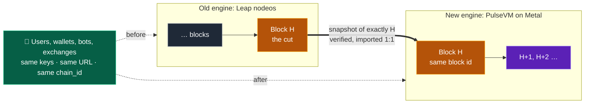
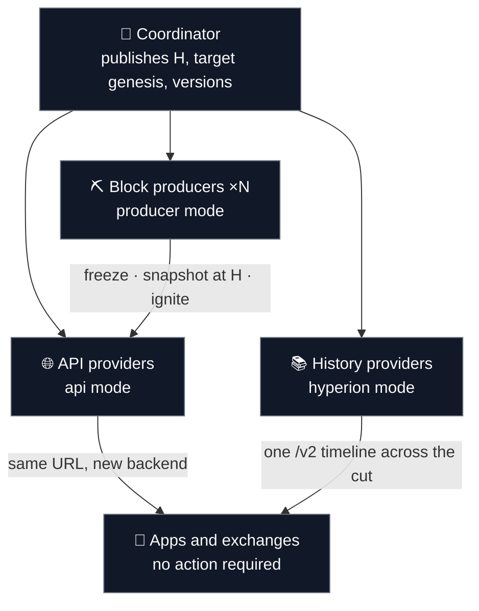
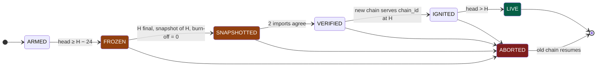
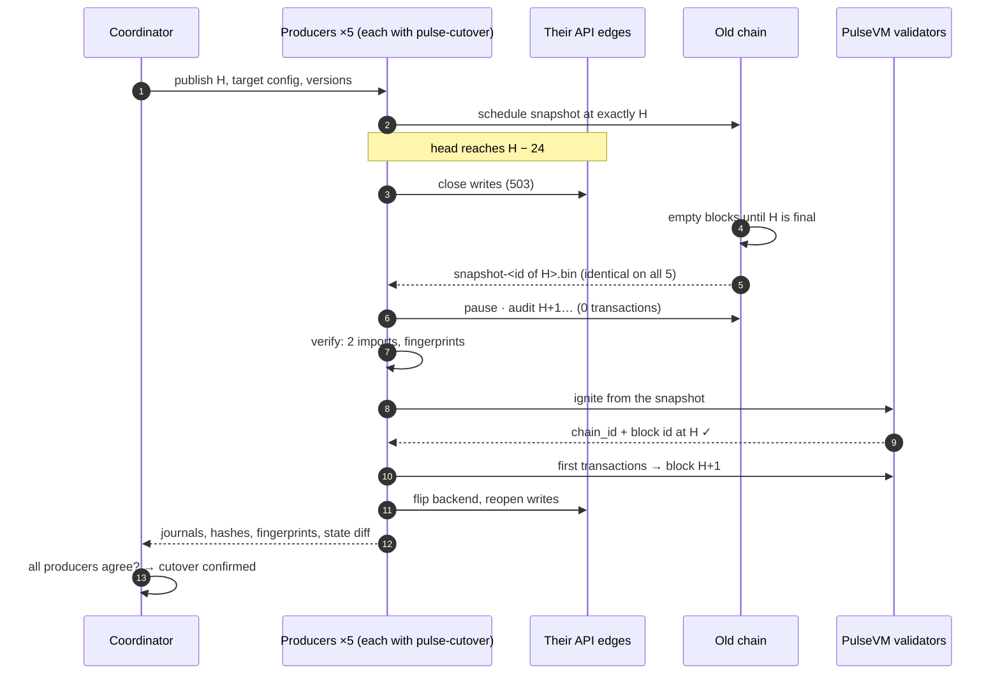
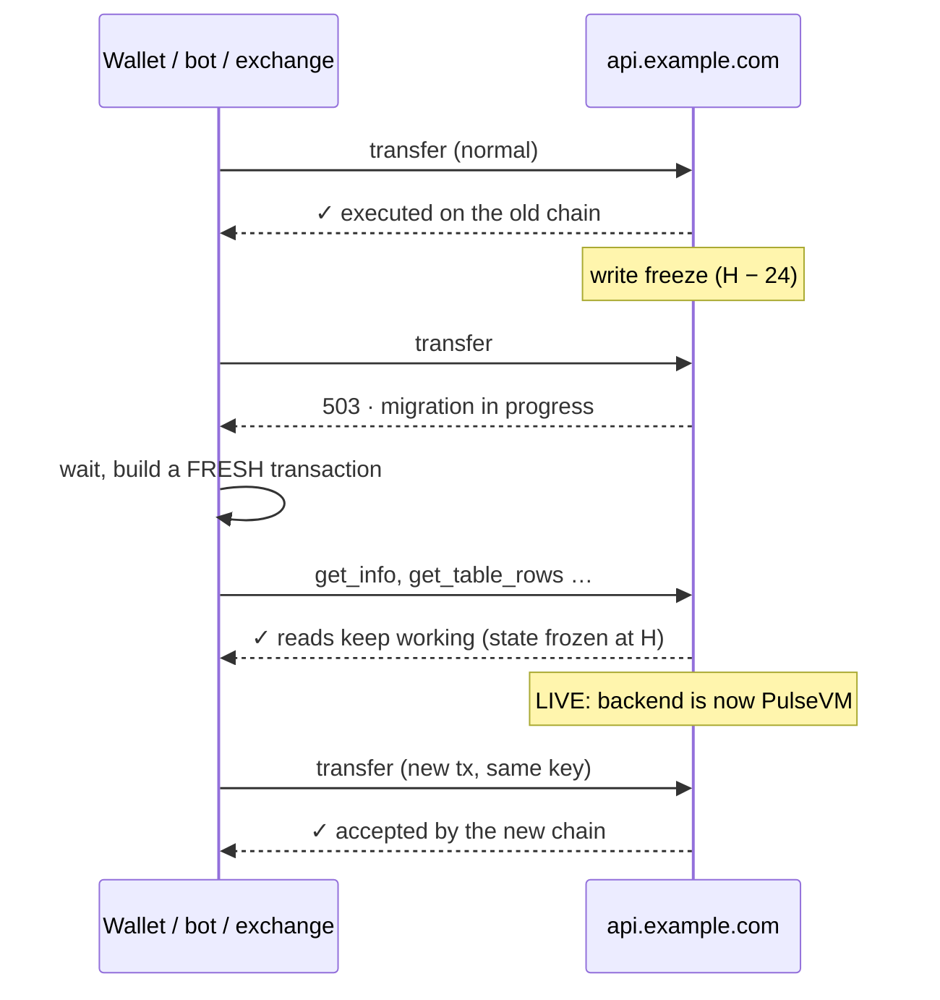
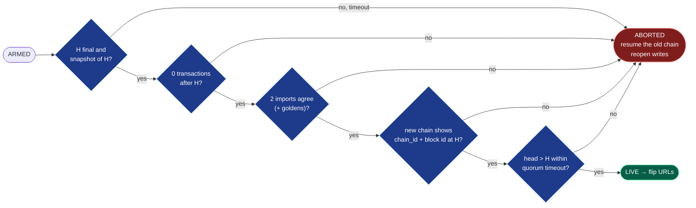

# The cutover process, step by step

How a running Antelope chain moves onto PulseVM **in one atomic step**, with every
block producer cutting the same block, the chain keeping its chain_id, and users
keeping their keys, balances and URLs.

> [!NOTE]
> Numbers on this page come from the recorded 5-producer rehearsal (Sydney · Singapore ·
> Los Angeles · New Jersey · Frankfurt, apps writing throughout). How each guarantee is
> *proven* lives in [ATOMICITY.md](../ATOMICITY.md). Hands-on setup is in the
> [README walkthrough](../README.md#start-here--the-operator-walkthrough).

**On this page:** [The idea](#1-the-idea-in-one-picture) · [Who does what](#2-who-does-what) ·
[The timeline](#3-the-timeline) · [Phase by phase](#4-phase-by-phase) ·
[Across the whole network](#5-across-the-whole-network) ·
[What apps see](#6-what-users-and-apps-see) · [Gates and rollback](#7-gates-and-rollback) ·
[After the cut](#8-after-the-cut-proving-it)

---

## 1. The idea in one picture

**One block, H, is the boundary.** Everything up to and including H is carried over byte-for-byte.
Block H+1 is the first block produced by PulseVM. Nobody re-signs anything, nobody moves
funds, and nothing depends on users doing anything.

| Stays the same | Changes |
|---|---|
| chain_id, accounts, keys, permissions, balances, contracts, table rows | the engine producing blocks (Leap DPoS → PulseVM on Metal/Avalanche consensus) |
| block numbering (H+1 follows H) | who finalizes blocks (Metal validators) |
| public API URLs and the `/v1/chain` API | a write pause of about a minute during the switch |

---

## 2. Who does what

| Role | Runs | Their job at the cut | Their users notice |
|---|---|---|---|
| **Coordinator** | nothing on-chain | Publishes H, the target chain config and the pinned versions; later compares everyone's evidence | — |
| **Block producer** | `pulse-cutover` in **producer mode** | Closes writes before H, snapshots exactly H, imports, becomes a validator of the new chain | ~1 min of HTTP 503 on writes |
| **API provider** | `pulse-cutover` in **api mode** | Follows the cut, imports the same H, flips its public URL to the new chain | ~1 min of 503 on writes; reads never stop |
| **History provider** | api mode + `[hyperion]` | Starts indexing at H+1, serves old and new history through one URL | nothing |
| **App / exchange** | nothing | Retry on 503 with a fresh transaction (see [§6](#6-what-users-and-apps-see)) | a short write pause |

---

## 3. The timeline

What happens around H, with the durations measured in the 5-producer rehearsal
(0.5 s blocks):

The same run on the wall clock (rehearsal run 3, all five producers within ±1 s of each other):

```mermaid
gantt
    title Rehearsal run 3: write freeze to LIVE (UTC)
    dateFormat HH:mm:ss
    axisFormat %H:%M:%S
    section Writes
    open on the old chain                :done, 22:59:40, 23:00:13
    frozen at the edge (503)             :crit, 23:00:13, 23:01:26
    open on PulseVM, same URL            :active, 23:01:26, 23:02:00
    section Ceremony
    empty blocks until H is final        :23:00:13, 23:01:02
    verify (2 imports + fingerprints)    :23:01:02, 23:01:03
    ignite (validator restart + import)  :23:01:03, 23:01:20
    first blocks → LIVE → URLs flip      :23:01:20, 23:01:26
```

| Moment | What it means |
|---|---|
| **T − days** | Everyone installs and rehearses (`doctor` → `install.sh` → rehearsal). H, versions and target config are published. |
| **H − 24 blocks** | **Write freeze.** API edges start answering writes with 503. Blocks keep coming, but they are empty. |
| **H** | **The cut.** Every producer's nodeos has been told in advance to snapshot exactly this block. |
| **H final** (≈ 35–50 s later) | The snapshot file lands (Leap writes it once H is irreversible). Producers pause. |
| **+1 s** | Verified: imported twice, fingerprints must match, no transactions after H. |
| **+10–20 s** | Ignited: PulseVM boots from the snapshot and presents the same chain_id at block H. |
| **+5 s** | LIVE: block H+1 exists, so the new chain is really producing. Only now do URLs flip. |

---

## 4. Phase by phase

Every phase has an entry condition, an action, a **gate** that must pass to move on, and
a defined abort. Each transition is written to an fsynced journal with its evidence.

### ① ARMED: preparing for the cut

| | |
|---|---|
| **Action** | Checks the environment, then tells nodeos *in advance* to write a snapshot at exactly block H (`schedule_at_h`). Watches the head approach. |
| **Users see** | Nothing. |
| **Gate** | Preflight passes (right chain_id, no stale snapshot staged, target configured). |
| **Why this way** | Scheduling the snapshot ahead is what makes every producer cut the *same* block. |

### ② FROZEN: writes stop, blocks don't

| | |
|---|---|
| **Action** | At `H − freeze_lead_blocks` (default 24 ≈ 12 s) the `on_freeze` hook closes writes at the API edge (nginx flag file or HAProxy runtime map → HTTP 503). Producers keep making **empty** blocks until H is irreversible. |
| **Users see** | Reads work. Writes get `503 chain migration in progress`. |
| **Gate** | H becomes final and the file `snapshot-<id of H>.bin` appears. |
| **Why this way** | Leap only writes a snapshot once the block is final, and a paused DPoS chain never finalizes (it deadlocks). Freezing writes *before* H lets anything still in flight land by H instead of after it. |

### ③ SNAPSHOTTED: the cut is pinned

| | |
|---|---|
| **Action** | Pauses the producer, waits until the head stops moving, pins the cut by height **and** block id, then audits every block from H+1 to the pause. |
| **Users see** | Still 503 on writes. |
| **Gate** | **Burn-off audit = 0 transactions after H.** An unreadable block also fails. |
| **Why this way** | A transaction after H exists on the old chain but not the new one. Rehearsal run 1 caught exactly this and aborted on every producer. |

### ④ VERIFIED: the snapshot is checked

| | |
|---|---|
| **Action** | Hashes the snapshot, imports it into two independent fresh databases, computes table fingerprints (19–21 tables). |
| **Users see** | Still 503 on writes. |
| **Gate** | Both imports agree, and match the published goldens when provided. Every producer ends up with the same numbers. |

### ⑤ IGNITED: PulseVM boots from block H

| | |
|---|---|
| **Action** | Stages the verified snapshot where the PulseVM chain expects it and restarts the validator. The chain imports it and presents **the source chain_id at block H with H's block id**. |
| **Users see** | Still 503 on writes. |
| **Gate** | Target chain_id == source chain_id, and target head == H with the cut's block id. |
| **Then** | The `post_ignite` hook sends a few transactions: PulseVM builds blocks on demand, so an idle new chain would never pass H. |

### ⑥ LIVE: the new chain is producing, URLs flip

| | |
|---|---|
| **Action** | Waits for head > H, meaning the validator set is really producing. Then the `on_live` hook flips the API edge's backend to PulseVM and reopens writes. |
| **Users see** | Writes work again, at the same URL, with the same keys. |
| **Gate** | Head past H before `quorum_timeout_secs`, otherwise abort and resume the old chain. |

---

## 5. Across the whole network

Each producer runs its own agent with the same H. There is no runtime coordination:
the scheduled snapshot guarantees the same cut, and the evidence is compared afterwards.

What must be identical on every producer (it was, on all 5, in every rehearsal run):

| Evidence | Where it comes from |
|---|---|
| cut height + block id | `SNAPSHOTTED` journal line |
| snapshot sha256 | `VERIFIED` journal line |
| table fingerprints | `VERIFIED` journal line |
| state digest, old@H vs new@H | `tools/state-diff.mjs` report |
| anchor block id on PulseVM | `IGNITED` journal line |

---

## 6. What users and apps see

**What apps should do** (every point was exercised by the rehearsal bots):

| Do | Why |
|---|---|
| Treat **503 as "hold"**, then retry with a **freshly built** transaction | Never re-send old signed bytes. A transaction that executed before the cut is rejected on the new chain as a duplicate; a fresh one is clean. |
| Use `expireSeconds ≥ 120` | The chain clock is frozen at the cut until the first new block. |
| Fail over across several endpoints | During the rehearsal every producer's edge answered reads throughout. |
| Confirm inclusion (read your state back) | On PulseVM an accepted transaction is in the mempool, not yet executed. |
| Oracle-driven apps: push a fresh price first after LIVE | The clock jumps by the pause length; a 120 s staleness window was not crossed at ~72 s, but a longer pause would cross it. |

---

## 7. Gates and rollback

**Nothing public changes before LIVE.** Every gate before that has one failure path:
abort, and the producer resumes the old chain as if nothing happened.

> [!IMPORTANT]
> Rollback is simply **resuming the paused producer** and reopening writes. The old chain was
> never modified; it just stopped for a minute. Rehearsal run 1 exercised this on all
> five producers at once.

---

## 8. After the cut: proving it

The cutover is atomic when five properties hold. Each is checked by a gate or a tool, and
the evidence is kept:

| | Property | Checked by |
|---|---|---|
| A1 | every producer cut the same block | journal: cut id, snapshot sha256, fingerprints |
| A2 | nothing landed after the cut | burn-off audit gate |
| A3 | old@H and new@H are byte-identical | `tools/state-diff.mjs` |
| A4 | exactly once across the boundary | `tools/replay-canary.mjs` + app ledgers |
| A5 | all or nothing | abort path + LIVE-only flips |

Full definitions and the recorded proof: **[ATOMICITY.md](../ATOMICITY.md)**.
Lessons from the real-world runs: **[README → Field notes](../README.md#field-notes-what-real-world-rehearsals-taught-us)**.
